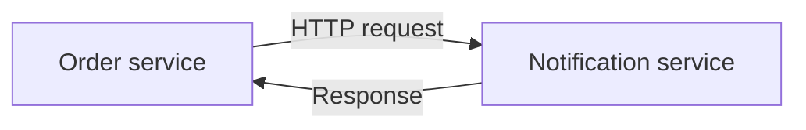
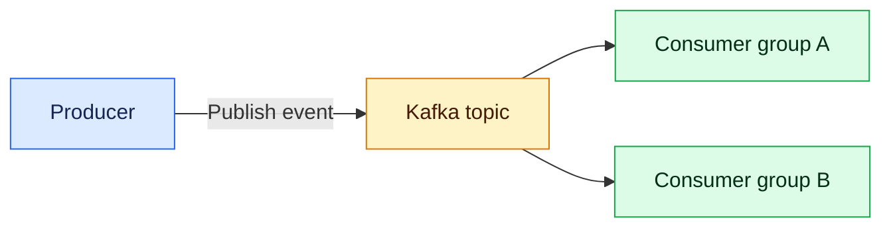
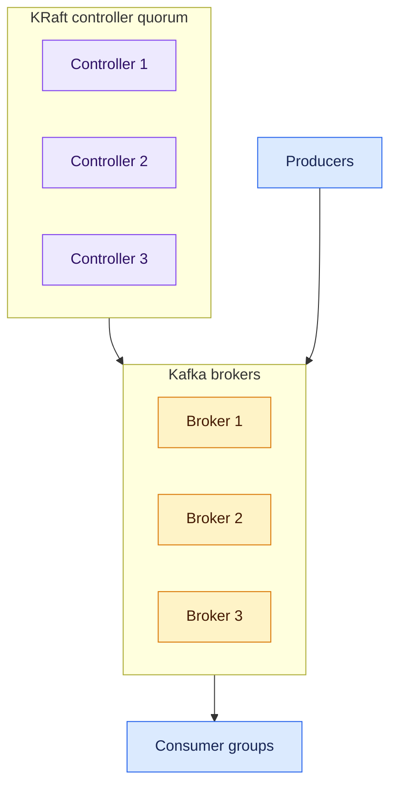
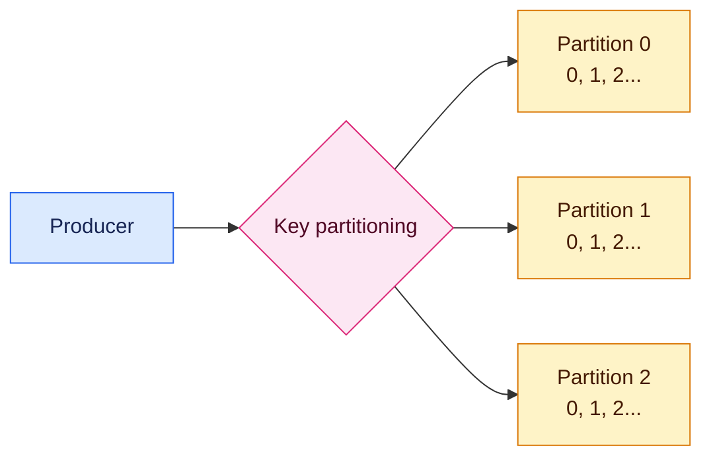
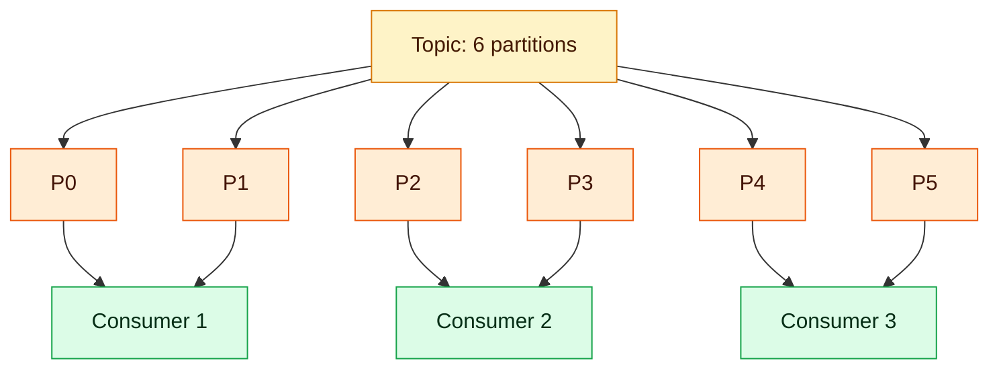
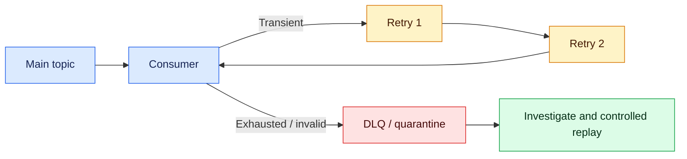

# Kafka Fundamentals: Zero to Hero

## 1. Purpose and learning path

This guide builds Kafka knowledge from first principles to the level expected of a senior Java engineer or architect. It explains not only definitions, but also message flow, configuration choices, failure behavior, Spring Boot usage, operational commands, and interview reasoning.

After completing it, you should be able to:

- explain why Kafka exists and when not to use it;
- design topics, partitions, keys, producers, and consumer groups;
- implement reliable Spring Boot producers and consumers;
- reason about ordering, offsets, duplicates, retries, and data loss;
- operate and troubleshoot Kafka with useful metrics and commands;
- discuss production security, capacity, schemas, and disaster recovery.

For deeper production decisions, continue with [Kafka Production Architecture](kafka-production-architecture.md).

---

## 2. Why Kafka?

In synchronous communication, the caller waits for the receiver:



This is simple, but the caller is coupled to the receiver's availability and latency.

Kafka introduces a durable event log between producers and consumers:



The producer does not wait for every consumer. Consumers can process independently and replay retained records.

Good use cases:

- domain events such as `order-created` or `attempt-submitted`;
- audit and activity streams;
- asynchronous workflows;
- change-data capture;
- stream processing and materialized views;
- high-volume integration between independently scalable systems.

Kafka is usually a poor choice for a simple request that needs an immediate answer, very small workloads with no asynchronous need, large binary-file storage, or replacing a transactional database.

---

## 3. Core vocabulary

| Term | Meaning |
|---|---|
| Record/event | Key, value, timestamp, headers, and metadata published to Kafka |
| Broker | Kafka server that stores partitions and serves clients |
| Cluster | Multiple brokers working together |
| Topic | Named durable stream of related records |
| Partition | Ordered append-only shard of a topic |
| Offset | Record position within one partition |
| Producer | Application that writes records |
| Consumer | Application that reads records |
| Consumer group | Consumers cooperating to divide partitions |
| Replica | Copy of a partition on another broker |
| Leader | Replica handling reads/writes for a partition |
| ISR | In-sync replicas sufficiently caught up with the leader |
| Controller quorum | KRaft controllers managing cluster metadata |
| Retention | How long/large records remain available |
| Compaction | Retaining the latest record for each key over time |

Kafka records are not removed merely because a consumer reads them. Retention is independent of consumption, enabling several groups and later replay.

---

## 4. Cluster architecture



Modern Kafka uses KRaft rather than ZooKeeper for metadata management. Controllers elect the active controller and maintain topic, partition, broker, and configuration metadata. Brokers store partition logs.

For an important production workload, a typical baseline is three availability-zone-aware brokers, replication factor 3, and three controllers. Exact sizing must follow throughput, storage, recovery, and availability requirements.

### Partition leadership and replication

For each partition, one replica is leader and the others are followers. Producers write to the leader. Followers replicate the log. If the leader fails, an eligible in-sync follower can become leader.

With replication factor 3 and `min.insync.replicas=2`, `acks=all` normally tolerates one replica being unavailable while retaining the required acknowledgement durability. Availability and durability remain configuration and failure-mode trade-offs.

---

## 5. Topics, partitions, offsets, and ordering

A topic is split into partitions for scale:



Kafka guarantees record order only within one partition, not across a whole multi-partition topic.

A producer key normally determines the partition:

```text
partition = hash(key) mod partition_count
```

All events for one `orderId` should use that order ID as key when lifecycle ordering matters. A null key commonly distributes records without entity ordering. A poor key can create a hot partition.

An offset is meaningful only with its topic and partition: `orders-2@1452`.

---

## 6. Producers

A producer serializes a key/value, chooses a partition, batches and compresses records, sends them to the partition leader, and handles acknowledgements or errors.

Important settings for significant events:

```properties
acks=all
enable.idempotence=true
compression.type=zstd
delivery.timeout.ms=120000
request.timeout.ms=30000
```

- `acks=0`: fastest, but producer does not wait for broker acknowledgement.
- `acks=1`: leader acknowledges; a leader failure before replication can lose data.
- `acks=all`: all current ISR replicas required by broker rules acknowledge.
- Idempotent producer: reduces duplicates created by retries within supported producer-session semantics.
- Batching and compression: improve throughput at a small latency/CPU trade-off.

Always inspect asynchronous send failures. A call returning successfully from application code does not necessarily mean the event was durably stored.

### Spring Boot producer

```java
@Service
public class AttemptEventPublisher {
    private final KafkaTemplate<String, AttemptSubmitted> kafkaTemplate;

    public AttemptEventPublisher(
            KafkaTemplate<String, AttemptSubmitted> kafkaTemplate) {
        this.kafkaTemplate = kafkaTemplate;
    }

    public CompletableFuture<SendResult<String, AttemptSubmitted>> publish(
            AttemptSubmitted event) {
        return kafkaTemplate.send(
                "interview.attempt-submitted.v1",
                event.attemptId().toString(),
                event);
    }
}
```

Do not blindly update a database and then publish to Kafka as two independent operations. A crash between them creates inconsistency. Use the [transactional outbox](../03-data-and-transactions/saga-and-transactional-outbox.md) when both effects must correspond.

---

## 7. Consumers and consumer groups

Consumers in the same group share partitions:



Within a group, one partition is assigned to at most one consumer at a time. If there are more consumers than partitions, some remain idle. Different groups independently read the same topic.

### Offsets

Kafka stores each group's committed position. The usual reliable sequence is:

1. poll records;
2. validate and process;
3. persist the business outcome;
4. commit the offset.

If the consumer crashes after step 3 but before step 4, the record is delivered again. Therefore consumers must be idempotent.

### Rebalancing

When consumers join, leave, fail, or partitions change, Kafka redistributes assignments. During a rebalance processing may pause. Long processing, blocked poll loops, unstable instances, or bad timeouts can cause repeated rebalances.

Important consumer settings include:

- `group.id`;
- `auto.offset.reset` for a group with no committed offset;
- `enable.auto.commit`;
- `max.poll.records`;
- `max.poll.interval.ms`;
- `session.timeout.ms`;
- fetch sizes and isolation level.

### Spring Boot consumer

```java
@KafkaListener(
    topics = "interview.attempt-submitted.v1",
    groupId = "evaluation-service")
@Transactional
public void consume(AttemptSubmitted event) {
    if (processedEventRepository.existsById(event.eventId())) {
        return;
    }

    evaluationService.start(event);
    processedEventRepository.save(new ProcessedEvent(event.eventId()));
}
```

Back the idempotency check with a database unique constraint. A read-then-insert check alone can race.

---

## 8. Delivery guarantees

| Model | Typical sequence | Main risk |
|---|---|---|
| At-most-once | Commit before processing | Loss from business perspective |
| At-least-once | Process before commit | Duplicate delivery |
| Kafka exactly-once | Kafka transaction covers consume/process-to-Kafka/offset | Does not automatically cover external side effects |

At-least-once plus an idempotent consumer is the common enterprise model.

Kafka transactions can atomically consume Kafka records, publish derived Kafka records, and commit offsets. They do not make a payment, email, REST call, or unrelated database update magically exactly once.

A credible goal is: effectively-once business outcome for documented failures using idempotency keys, unique constraints, state transitions, outbox/inbox records, compensation, and reconciliation.

---

## 9. Retention and compaction

### Time/size retention

With `cleanup.policy=delete`, old log segments are removed after configured time or size limits. This supports replay within the retention window.

### Log compaction

With `cleanup.policy=compact`, Kafka eventually keeps the latest value for each key. A null value is a tombstone representing deletion. Compaction is asynchronous and older versions may remain temporarily.

Common examples include change logs and rebuilding a latest-state cache. Kafka is still not a queryable relational database.

---

## 10. Serialization and schema evolution

Text and raw JSON are simple, but governed systems often use Avro, Protobuf, or JSON Schema with a schema registry.

A useful event envelope contains:

```json
{
  "eventId": "0b9c...",
  "eventType": "InterviewAttemptSubmitted",
  "schemaVersion": 1,
  "occurredAt": "2026-08-01T08:00:00Z",
  "producer": "interview-orchestrator",
  "traceId": "abc123",
  "tenantId": "tenant-7",
  "data": {}
}
```

Prefer additive compatible changes, never silently change a field's meaning, test compatibility in CI, minimize sensitive data, and create a deliberate new version for incompatible semantics.

---

## 11. Retry, dead-letter, and backpressure

Classify failures before retrying:

| Failure | Response |
|---|---|
| Temporary timeout | Bounded exponential retry with jitter |
| Downstream overload | Pause/back off; protect the dependency |
| Invalid event/schema | Quarantine promptly |
| Permanent business rejection | Record outcome; normally no retry |
| Repeated unknown error | Failure topic, alert, investigation |

A common flow:



Retry topics may change ordering. If strict per-key order is mandatory, pause the affected partition or serialize work by entity, accepting lower throughput.

Kafka producers do not directly know whether consumers are slow. Operators and applications detect it through consumer lag, event age, processing latency, queue saturation, and downstream health. Consumers can pause partitions; systems can scale consumers up to partition count, shed work, or reduce production only through an explicit feedback/control mechanism.

A DLQ needs an owner, alert, access policy, retention, correction process, replay tool, audit trail, and idempotency protection.

---

## 12. Security

Production Kafka should use:

- TLS for client and inter-broker traffic;
- authentication using mTLS, SASL/SCRAM, or supported cloud identity;
- separate service identities;
- least-privilege ACLs for topics, groups, and operations;
- secrets from a secret manager with rotation;
- private networking and restricted administrative access;
- encryption at rest according to policy;
- audited configuration and ACL changes;
- data classification, minimization, retention, and deletion controls.

Never share one powerful credential across all applications or put secrets in source control.

---

## 13. Monitoring and observability

Monitor the cluster and business flow.

Broker/controller signals:

- broker availability and controller health;
- offline and under-replicated partitions;
- ISR shrink/expand;
- produce/fetch errors and latency;
- disk capacity/latency, CPU, network, and request queues;
- throttling and replication health.

Consumer signals:

- lag in records and time;
- processing rate, latency, and failures;
- rebalance count and duration;
- retries, DLQ volume, and replay;
- last successfully processed event time.

Business signals:

- event occurrence-to-outcome latency;
- orders/interviews/payments completed;
- stuck workflows;
- outbox age;
- duplicate suppression and reconciliation differences.

Zero consumer lag does not prove correctness. A consumer can discard every event and still report zero lag.

---

## 14. Capacity basics

Start with measurable assumptions:

```text
ingress_bytes_per_second = events_per_second × average_record_bytes
daily_ingress = ingress_bytes_per_second × 86,400
replicated_storage = daily_ingress × retention_days × replication_factor
consumer_egress ≈ ingress × number_of_full_consumer_groups
```

Add compression effects, indexes, segment overhead, compaction, bursts, replay traffic, replication, and safety headroom. Benchmark realistic payloads and failure recovery.

Partition count must support required consumer parallelism and throughput without producing excessive metadata, files, rebalancing, or recovery time.

---

## 15. Essential commands

Examples assume Kafka CLI tools are available and authentication options are supplied securely.

```bash
# List topics
kafka-topics.sh --bootstrap-server localhost:9092 --list

# Create a topic
kafka-topics.sh --bootstrap-server localhost:9092 \
  --create --topic interview.attempt-submitted.v1 \
  --partitions 6 --replication-factor 3

# Describe partitions and replicas
kafka-topics.sh --bootstrap-server localhost:9092 \
  --describe --topic interview.attempt-submitted.v1

# Produce records
kafka-console-producer.sh --bootstrap-server localhost:9092 \
  --topic interview.attempt-submitted.v1 \
  --property parse.key=true --property key.separator=:

# Consume from beginning with a temporary group
kafka-console-consumer.sh --bootstrap-server localhost:9092 \
  --topic interview.attempt-submitted.v1 \
  --from-beginning --group learning-consumer

# Inspect consumer offsets and lag
kafka-consumer-groups.sh --bootstrap-server localhost:9092 \
  --describe --group evaluation-service
```

Be cautious resetting offsets: it causes replay or skipping and must be an authorized, audited operational action with idempotent consumers.

---

## 16. Troubleshooting sequence

| Symptom | Likely checks |
|---|---|
| Producer timeout | Broker reachability, metadata, ISR, `min.insync.replicas`, auth, message size |
| Consumer receives nothing | Topic, group, offset position, deserializer, ACL, assignment |
| Lag continually grows | Processing rate, downstream latency, hot partition, errors, partition/consumer count |
| Duplicate business effects | Commit timing, idempotency constraint, retries, rebalance/crash |
| Records appear out of order | Keys, partitions, retries, concurrency, retry-topic design |
| Frequent rebalances | Poll duration, crashes, probes, membership, session and poll timeouts |
| One partition overloaded | Key distribution and dominant tenant/entity |
| Disk fills | Retention, traffic growth, replication, compaction, capacity alerting |
| Schema errors | Producer/consumer versions and compatibility policy |

Diagnose from facts in this order:

```text
producer logs and send result
→ topic/partition metadata
→ broker and ISR health
→ record existence
→ group assignment and committed offsets
→ consumer logs and processing latency
→ downstream database/service
→ business outcome and trace
```

---

## 17. Local learning lab

A useful practice sequence:

1. Start a multi-broker Kafka lab using Docker Compose.
2. Create a six-partition topic.
3. Produce keyed events and observe partition placement.
4. Start one consumer, then add consumers to the same group.
5. Start another group and observe independent consumption.
6. Stop a consumer and watch reassignment.
7. Fail processing before offset commit and observe redelivery.
8. Add a unique event-ID constraint and prove idempotency.
9. Add bounded retries and a quarantine topic.
10. Measure consumer lag during an intentionally slow downstream call.
11. Add schema compatibility checks.
12. Kill a broker and inspect leader/ISR behavior.
13. Rebuild a read model by replaying retained events.
14. Document the evidence, failure behavior, and limitations.

---

## 18. Interview misconceptions

- **“Kafka guarantees global ordering.”** No—ordering is per partition.
- **“More consumers always increase throughput.”** Only until active consumers equal assigned partitions.
- **“Kafka loses no messages.”** Loss depends on producer acknowledgements, replicas, ISR rules, retention, unclean election, operations, and consumer behavior.
- **“Exactly once solves all duplicates.”** Kafka EOS does not automatically include external systems.
- **“A DLQ fixes failures.”** It only stores failed records; operational handling is still required.
- **“Consumer lag tells the producer that consumers are slow.”** Lag is observed through monitoring; feedback requires explicit control.
- **“Kafka replaces a database.”** Kafka is a durable event log, not a general-purpose transactional query store.
- **“Three brokers automatically means HA.”** Placement, quorum, replication, client failover, and testing determine availability.

---

## 19. Two-minute interview answer

> Kafka is a distributed append-only event log used to decouple producers from independently scalable consumers. A topic is divided into partitions, and ordering is guaranteed only inside a partition, so I choose a stable business key such as order ID. Brokers replicate partitions; for critical events I commonly use replication factor three, `min.insync.replicas=2`, `acks=all`, and idempotent producers.
>
> Consumers in a group divide partitions, while separate groups receive the stream independently. I process first and commit offsets only after the durable business outcome, which gives at-least-once delivery, so consumers use event IDs and database unique constraints for idempotency. For database-to-Kafka consistency I use a transactional outbox rather than a dual write. Transient failures get bounded backoff; invalid or exhausted records go to an owned quarantine flow.
>
> I govern schemas, secure clients with TLS and service identities, apply least-privilege ACLs, and monitor ISR health, throughput, disk, lag, event age, retries, and business outcomes. Kafka transactions can provide exactly-once behavior inside supported Kafka flows, but external database or payment effects still need idempotency, compensation, and reconciliation.

---

## 20. Hero-level checklist

- [ ] Can explain Kafka without calling it merely a queue
- [ ] Can select a partition key from ordering requirements
- [ ] Understands replicas, leaders, ISR, and KRaft quorum
- [ ] Can explain `acks=all` with `min.insync.replicas`
- [ ] Can implement and test idempotent consumers
- [ ] Understands offset commits and rebalances
- [ ] Can distinguish retention from compaction
- [ ] Can design retries without hiding poison records
- [ ] Can evolve schemas compatibly
- [ ] Can estimate storage, throughput, and consumer parallelism
- [ ] Can secure Kafka identities and permissions
- [ ] Can diagnose lag and hot partitions
- [ ] Can explain the limits of exactly-once claims
- [ ] Can run broker, consumer, replay, and recovery exercises

## Next study

Continue with:

1. [Kafka Production Architecture](kafka-production-architecture.md)
2. [Saga and Transactional Outbox](../03-data-and-transactions/saga-and-transactional-outbox.md)
3. Apply both patterns in [Java_AI_MCP](https://github.com/Skpandey15/Java_AI_MCP).
