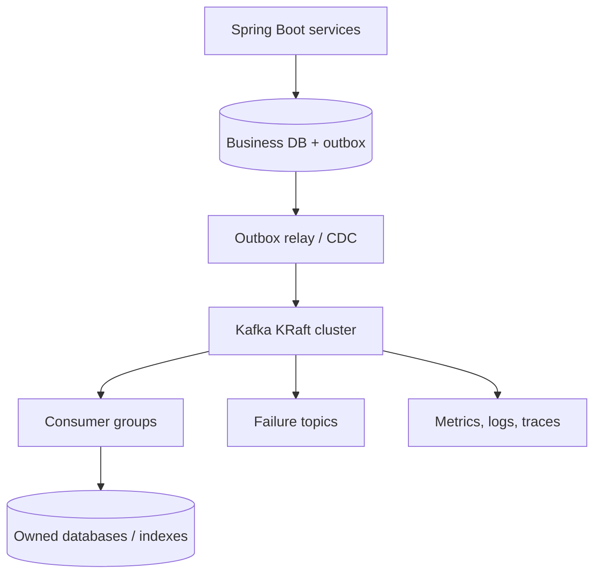

# Kafka Production Architecture

## 1. Executive summary

Apache Kafka is a distributed event-streaming platform for durable, ordered logs and scalable consumption. It is not a replacement for every API, database, job queue, or business transaction.

A production design begins with business invariants: what may be lost, duplicated, reordered, delayed, or replayed. Broker configuration matters, but end-to-end correctness also depends on producers, consumers, databases, schemas, security, capacity, and operations.

## 2. Reference architecture



Use KRaft metadata management for modern Kafka deployments. Separate controller and broker roles for larger or critical clusters when failure isolation and predictable capacity justify the additional nodes.

## 3. Cluster topology

An initial production baseline for an availability-zone-aware environment:

- at least three brokers distributed across three zones;
- three KRaft controllers for quorum, either dedicated or combined for smaller workloads;
- replication factor 3 for critical topics;
- rack awareness configured to spread replicas;
- private networking, TLS, authenticated clients, and least-privilege ACLs;
- separate production from non-production;
- tested backup/replication and regional recovery strategy.

Three nodes are not automatically highly available. Zone placement, quorum, replication health, client failover, DNS, network paths, and operating procedures must all be validated.

## 4. Topic and partition design

### Topic ownership

Every topic needs:

- a business purpose and owning team;
- producer and consumer contracts;
- data classification and retention;
- partition-key rationale;
- SLOs and capacity assumptions;
- schema compatibility policy;
- replay and deletion procedures.

Prefer domain event names such as `interview.attempt-submitted.v1` over implementation commands such as `call-evaluation-service`.

### Partition key

Kafka preserves order only within a partition. Select a stable key matching the business ordering boundary.

| Workflow | Likely key | Ordering scope |
|---|---|---|
| Interview attempt lifecycle | `attemptId` | Events for one attempt |
| Customer account changes | `accountId` | Events for one account |
| Order lifecycle | `orderId` | Events for one order |
| Tenant audit events | Often `tenantId` plus strategy | Must assess hot tenants |

Avoid random keys when entity ordering matters. Avoid a low-cardinality or dominant key that creates hot partitions.

### Partition count

Partition count controls parallelism and affects metadata, open files, replication traffic, recovery time, and ordering. Estimate it from:

- peak ingress bytes/sec;
- peak egress and number of consumer groups;
- processing time and desired consumer parallelism;
- broker and storage throughput benchmarks;
- growth headroom.

Partitions can be added, but existing keys may map differently afterward. This can affect cross-record ordering expectations. Treat partition count as a capacity decision, not a magic constant.

## 5. Producer reliability

Recommended baseline for important events:

```properties
acks=all
enable.idempotence=true
retries=2147483647
max.in.flight.requests.per.connection=5
compression.type=zstd
delivery.timeout.ms=<bounded business value>
request.timeout.ms=<less than delivery timeout>
```

Also configure the topic with an appropriate `min.insync.replicas`, commonly 2 when replication factor is 3. Then one replica may be unavailable while writes can still meet the configured durability rule.

Important distinctions:

- `acks=all` acknowledges after all current in-sync replicas have the record; it does not mean every configured replica.
- Idempotent production prevents duplicates caused by producer retries within its supported producer session semantics.
- It does not make a database update and Kafka publish atomic.
- Producer callbacks and error handling must not silently discard failed sends.

Use the transactional outbox pattern or CDC when a service must commit business data and publish an event without a dual-write gap.

## 6. Delivery semantics and business correctness

### At-most-once

Offsets may be advanced before processing. Messages can be lost from the consumer's business perspective.

### At-least-once

Process first, then commit offsets. Redelivery can occur after failure. This is the normal production choice when consumers are idempotent.

### Kafka exactly-once semantics

Kafka transactions can atomically consume, transform, produce Kafka records, and commit Kafka offsets when all relevant clients and topics are correctly configured.

They do not automatically make an external database, email, payment provider, or REST side effect exactly once. For those boundaries use:

- idempotency keys and unique constraints;
- inbox/deduplication records;
- compare-and-set state transitions;
- outbox events;
- reconciliation jobs;
- business-specific compensation.

Prefer the honest goal: **effectively-once business outcome under documented failure conditions**.

## 7. Consumer architecture

A partition is assigned to at most one consumer within a consumer group at a time. One consumer can own multiple partitions. Different consumer groups read the topic independently.

Consumer responsibilities:

1. Disable or carefully control automatic offset commits.
2. Validate the event envelope and schema.
3. Enforce authorization/trust assumptions at ingestion boundaries.
4. Process within `max.poll.interval.ms` or offload work safely.
5. Commit offsets only after the durable business outcome.
6. Make processing idempotent.
7. Pause or shed load when downstream capacity is exhausted.
8. Emit lag, processing, retry, and business-outcome metrics.

Use static membership and cooperative rebalancing where appropriate to reduce avoidable partition movement, but still design for rebalances and duplicate processing.

## 8. Retry and poison-event strategy

Do not retry indefinitely on the main consumer thread.

Classify failures:

| Failure | Action |
|---|---|
| Transient dependency failure | Bounded retries with exponential backoff and jitter |
| Rate limit/overload | Pause, back off, and preserve downstream capacity |
| Invalid schema or data | Quarantine; do not repeatedly block the partition |
| Permanent business rejection | Record outcome; normally do not retry |
| Unknown repeated failure | Failure topic plus alert and investigation |

A common topology is main topic → retry topics with increasing delays → dead-letter/quarantine topic. This may relax per-key ordering. If strict ordering is mandatory, pause the affected partition or design entity-level work queues, accepting throughput impact.

A dead-letter topic is not a solution by itself. Define ownership, alerting, retention, data access, correction, replay authorization, idempotency, and audit.

## 9. Schema and event evolution

Use Avro, Protobuf, or JSON Schema with a schema registry where governance warrants it.

Rules:

- include event ID, event type, schema version, occurred time, producer, trace context, and business key;
- prefer additive, backward-compatible changes;
- do not reuse a field with new meaning;
- distinguish domain occurrence time from publish time;
- protect sensitive fields and minimize personal data;
- test producer and consumer compatibility in CI;
- version semantically incompatible contracts deliberately.

Events are immutable facts. Corrections should normally be new events, not silent mutation of history.

## 10. Security

- TLS for client-broker and inter-broker traffic
- Strong client authentication such as mTLS, SASL/SCRAM, or supported cloud identity
- Least-privilege ACLs by service identity, topic, group, and operation
- Secrets from an approved secret manager with rotation
- Network segmentation and restricted broker exposure
- Encryption at rest according to platform policy
- Audit administrative and ACL changes
- Mask or avoid personal and secret data in events and telemetry
- Apply retention and deletion policies, including compacted-topic implications

Do not let all applications share one Kafka credential.

## 11. Capacity and retention

Estimate separately:

```text
daily_ingress = peak_or_average_events_per_second × average_record_bytes × 86,400
replicated_storage = daily_ingress × retention_days × replication_factor
network = producer ingress + replication + consumer-group egress + reprocessing
```

Add protocol, index, filesystem, compaction, burst, and safety overhead. Benchmark representative record sizes, compression, keys, acknowledgements, storage, and consumer patterns.

Retention is a business and recovery decision. Log compaction retains the latest value per key eventually; it is not an immediate deduplicated database and tombstone handling requires care.

## 12. Observability and SLOs

Monitor both platform and business flow:

- under-replicated/offline partitions and ISR changes;
- controller and broker health;
- request latency/error rate and throttling;
- disk usage, disk latency, network saturation, CPU, and page-cache pressure;
- produce/fetch throughput and record sizes;
- consumer lag in records and time;
- rebalance count and duration;
- processing success, retry, quarantine, and replay rates;
- outbox age and publish latency;
- end-to-end event freshness from occurrence to durable outcome.

Consumer lag alone is insufficient. Zero lag with failed or semantically incorrect processing is still an outage.

Define alerts from SLO impact and actionable thresholds; attach runbooks and owners.

## 13. Multi-region and disaster recovery

Choose explicitly:

| Model | Characteristics |
|---|---|
| Backup and restore | Lowest cost, longest RTO/RPO |
| Active-passive replication | Faster recovery; requires failover and offset/data strategy |
| Active-active by region | Highest complexity; conflict, duplicate, ordering, and ownership design required |

Cross-region replication is generally asynchronous. It may lose the newest acknowledged records during regional failure unless the architecture and acknowledgement path explicitly provide stronger guarantees.

Test:

- regional failover and client reconfiguration;
- replicated topic completeness and lag;
- consumer offset strategy;
- downstream database recovery;
- duplicate processing after failover;
- failback and reconciliation.

## 14. Kubernetes guidance

Kafka can run on Kubernetes, but it requires stateful operational maturity. Use a capable operator and understand storage classes, topology spread, pod disruption, rolling upgrades, certificates, quotas, and broker replacement.

Do not use liveness probes that repeatedly restart a slow but recoverable broker. Protect quorum and replica availability during voluntary disruptions. Managed Kafka may be preferable when the team wants the service qualities without owning broker operations.

## 15. Interview-platform event flow

For `attempt-submitted`:

1. The orchestrator commits the submitted attempt and outbox record in one PostgreSQL transaction.
2. A relay publishes an event keyed by `attemptId`.
3. Kafka stores replicated records.
4. The evaluation consumer validates the schema and inserts an inbox/event ID under a unique constraint.
5. It starts or records evaluation idempotently.
6. AI/provider timeouts use bounded retry; exhausted work moves to a controlled manual-review path.
7. Result publication remains a separate authorized business transition.
8. Telemetry measures submission-to-evaluation latency and failure outcomes.

Kafka is not the authoritative store for candidate answers or final results; PostgreSQL remains the system of record.

## 16. Production readiness checklist

- [ ] Business loss, duplicate, ordering, replay, and latency tolerances documented
- [ ] Topic owner, schema, key, retention, and classification recorded
- [ ] Replication factor, ISR policy, rack awareness, and failure tests validated
- [ ] Producer failure handling and outbox/CDC strategy tested
- [ ] Consumers idempotent with controlled offset commits
- [ ] Retry, quarantine, replay, and reconciliation runbooks tested
- [ ] TLS, authentication, ACLs, secret rotation, and audit enabled
- [ ] Capacity benchmark includes peak and recovery traffic
- [ ] Dashboards and SLO-based alerts cover platform and business freshness
- [ ] Upgrade, broker loss, zone loss, restore, and regional recovery rehearsed

## 17. Interview answer

> Kafka production architecture starts with business delivery and ordering requirements. I select keys from the required ordering boundary, size partitions from measured throughput and consumer parallelism, and use replication factor 3, rack awareness, acks=all, min ISR, and idempotent producers for critical events. Database-to-Kafka publication uses an outbox or CDC. Consumers are at-least-once and idempotent, with explicit offset control, bounded retry, quarantine, and replay procedures. I govern schemas, secure every client identity, observe end-to-end event freshness, and test broker, zone, dependency, and regional failures. I do not claim external side effects are exactly once merely because Kafka transactions are enabled.
