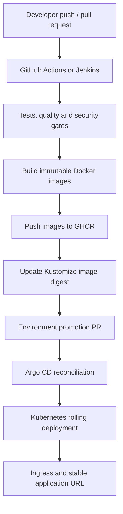
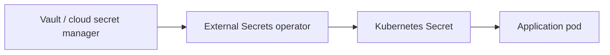

# Complete CI/CD Pipeline: Docker, Kubernetes, Argo CD and Ingress

## 1. Purpose

This chapter explains an end-to-end, production-oriented CI/CD pipeline for a Java, Python, and React application deployed to Kubernetes.

The target outcome is:

> A developer pushes code to GitHub. Continuous Integration validates the change, builds and scans immutable container images, and publishes them to a registry. A controlled Git update promotes the new image. Argo CD detects that desired-state change, synchronizes Kubernetes, verifies rollout health, and the application remains available through a stable Ingress URL.

This is both an interview guide and a practical blueprint for the [Java_AI_MCP](https://github.com/Skpandey15/Java_AI_MCP) application.

For focused foundational revision, see [Docker and Kubernetes Fundamentals for CI/CD Engineers](docker-kubernetes-fundamentals.md), written for interviews at approximately three years of CI/CD experience.

For complete Jenkins examples, see [Jenkins CI/CD Pipeline: Branch Build, Artifact Publishing and Environment Deployment](jenkins-ci-cd-pipeline.md), covering branch-based CI and parameterized promotion to dev, integration, UAT, staging, pre-production and production.

---

## 2. CI, delivery, deployment and GitOps

These terms are related but are not interchangeable.

| Term | Meaning | Typical responsibility |
|---|---|---|
| Continuous Integration | Validate every change and produce a trusted artifact | GitHub Actions or Jenkins |
| Continuous Delivery | Keep a releasable version ready; production may require approval | CI plus promotion workflow |
| Continuous Deployment | Automatically release every accepted change | Promotion plus automated CD |
| GitOps | Git contains the desired runtime state; a cluster agent reconciles it | Argo CD |
| Ingress | Routes external HTTP/HTTPS traffic to cluster Services | NGINX or Traefik Ingress Controller |

**Argo CD is not the build system.** It does not normally compile Java, run unit tests, or build Docker images. GitHub Actions or Jenkins performs CI. Argo CD performs CD by reconciling Kubernetes state from Git.

---

## 3. End-to-end architecture



### Control plane and data plane

- **CI control plane:** GitHub, runners, test tools, scanners and registry publishing.
- **GitOps control plane:** Git repository, Argo CD, Kubernetes API and policy engine.
- **Application data plane:** Ingress controller, Services, pods, databases, Kafka and downstream systems.

Separating these concerns reduces credentials, makes changes auditable and improves rollback.

---

## 4. Reference technology stack

| Layer | Recommended choice | Purpose |
|---|---|---|
| Source control | GitHub | Code review, branch protection and audit history |
| CI engine | GitHub Actions or Jenkins | Test, package, scan and publish |
| Java build | Gradle Groovy with Java 21 | Build and test Spring Boot |
| Python build | uv/pip plus pytest | Validate FastAPI service |
| Frontend build | npm with Vite | Test and build React application |
| Container build | Docker BuildKit/buildx | Reproducible multi-stage images |
| Image registry | GHCR | Store immutable OCI images |
| Image scanning | Trivy | OS and application vulnerability detection |
| Manifest management | Kustomize | Base resources plus environment overlays |
| CD engine | Argo CD | Pull-based Kubernetes reconciliation |
| Edge routing | NGINX or Traefik Ingress | Stable HTTP/HTTPS routes |
| Certificates | cert-manager | Automated TLS certificate lifecycle |
| Secrets | External Secrets/Vault | Keep secret values out of Git |
| Observability | OpenTelemetry, Prometheus, Grafana and logs | Release and runtime visibility |

Jenkins can replace GitHub Actions for CI. The downstream contract should remain the same: CI publishes an immutable artifact and proposes a desired-state Git change; Argo CD deploys it.

---

## 5. Repository strategy

### Option A: application and deployment manifests in one repository

```text
Java_AI_MCP/
├── interview-orchestrator/
├── ai-service/
├── web-ui/
├── .github/workflows/
└── platform/kubernetes/
    ├── base/
    └── overlays/
        ├── local/
        ├── dev/
        ├── uat/
        └── prod/
```

This is simple for a small team. CI must avoid recursively triggering itself when it updates only manifests.

### Option B: separate application and environment repositories

```text
Java_AI_MCP/              # source code and CI
Java_AI_MCP-environments/ # desired deployment state
```

This provides stronger separation of duties, cleaner environment audit history and tighter production permissions. It is usually preferable at enterprise scale.

### Kustomize layout

- **base:** common Deployments, Services, probes, security contexts and resource policies.
- **local overlay:** developer cluster settings and local hostnames.
- **dev overlay:** automatic synchronization and smaller capacity.
- **uat overlay:** controlled promotion and production-like configuration.
- **prod overlay:** approvals, replicas, disruption budgets, autoscaling and TLS.

Never copy complete YAML files between environments when an overlay can express only the difference.

---

## 6. Trigger strategy

### Pull request pipeline

A pull request should run fast feedback and must not deploy production.

1. Checkout an exact commit.
2. Restore dependency caches safely.
3. Compile and lint.
4. Run unit and component tests.
5. Run secret, dependency, SAST and IaC checks.
6. Build images to prove Dockerfiles work.
7. Optionally deploy an ephemeral preview environment.
8. Publish checks back to the pull request.

### Main-branch pipeline

After a protected pull request merges:

1. Repeat trusted tests on the merge commit.
2. Build each changed service.
3. Generate an SBOM.
4. Scan the final image.
5. Sign/provenance-attest the image where required.
6. Push it to GHCR.
7. Capture its immutable digest.
8. Open or update a dev-promotion PR.
9. Merge according to environment policy.

### Path filters

In a monorepo, changes to `web-ui/**` should not rebuild every backend unless shared code or deployment contracts changed. Path filtering reduces time and cost, but shared dependency changes must trigger all affected components.

---

## 7. Quality and security gates

A production CI pipeline should use layered gates.

| Gate | Examples | Failure policy |
|---|---|---|
| Compilation and lint | Gradle, Checkstyle, ESLint, Ruff | Block |
| Unit tests | JUnit, pytest, Vitest | Block |
| Integration tests | Testcontainers, API contract tests | Block |
| Coverage | JaCoCo and language equivalents | Threshold plus trend |
| Dependency scan | Dependabot/SCA/Trivy | Block according to severity and exploitability |
| Secret scan | Gitleaks or platform secret scanning | Block immediately |
| SAST | CodeQL/Semgrep | Risk-based |
| Container scan | Trivy/Grype | Block unacceptable findings |
| IaC validation | Kustomize render, kubeconform, policy checks | Block |
| SBOM | SPDX or CycloneDX | Generate and retain |
| Image signing | Sigstore Cosign | Enforce for protected environments |

A vulnerability gate should support documented, time-bounded exceptions. Blindly blocking every finding creates bypass culture; ignoring all findings creates unacceptable risk.

---

## 8. Building production container images

### Multi-stage build

A Java image should compile in a builder stage and run from a minimal runtime stage. The final image should not contain Gradle caches, source code, compilers or test tools.

The same principle applies to React and Python:

- React assets are built with Node and served by a hardened web server.
- Python dependencies are resolved deterministically and copied into a minimal runtime.
- Containers run as non-root.
- Base images are pinned and regularly refreshed.
- Only required ports and files are present.
- A `.dockerignore` excludes Git metadata, secrets, caches and build output.

### Tag and digest policy

Useful tags include:

```text
main
sha-<git-commit>
v1.4.2
```

Tags are mutable pointers. Production deployment should pin the digest:

```text
ghcr.io/skpandey15/java-ai-mcp-orchestrator@sha256:<digest>
```

The digest guarantees that Kubernetes pulls the exact scanned bytes. Do not use `:latest` for controlled environments.

### Reproducibility and supply chain

- Pin dependencies through lock files.
- Use trusted base-image sources.
- Build from an exact Git SHA.
- Generate SBOM and provenance.
- Sign images.
- Admit only approved registries and verified signatures where policy tooling is available.

---

## 9. Publishing to GHCR

CI receives minimum permissions:

- read repository content;
- write packages only in the image-publish job;
- create a promotion pull request if required;
- request an OIDC identity rather than storing long-lived cloud credentials where supported.

The Kubernetes cluster receives a read-only registry credential if the package is private. The credential is stored as an `imagePullSecret` or synchronized from a secret manager.

Important failure checks:

- repository/package visibility;
- correct lowercase image path;
- valid image tag or digest;
- token permission to read packages;
- architecture compatibility, such as `linux/amd64`;
- imagePullSecret attached to the correct ServiceAccount and namespace.

---

## 10. Manifest promotion

CI should not execute `kubectl apply` against production. Instead, it changes the desired image digest in Git.

Example Kustomize intent:

```yaml
images:
  - name: ghcr.io/skpandey15/java-ai-mcp-orchestrator
    newName: ghcr.io/skpandey15/java-ai-mcp-orchestrator
    digest: sha256:<immutable-digest>
```

### Environment policy

| Environment | Promotion | Argo CD sync |
|---|---|---|
| Local | Developer controlled | Manual/local |
| Dev | Automatic PR or bot commit after main succeeds | Automatic |
| UAT | PR with test evidence and approval | Manual or automatic after approval |
| Production | Explicit approval/change policy | Controlled synchronization |

A single artifact should be promoted across environments. Do not rebuild the same source independently for UAT and production; that would produce different bytes and invalidate prior testing.

---

## 11. Argo CD application model

Argo CD continuously compares:

- **desired state:** manifests rendered from the configured Git revision and path;
- **live state:** resources currently in the Kubernetes cluster.

If they differ, Argo CD reports drift and, according to policy, synchronizes the cluster.

Example:

```yaml
apiVersion: argoproj.io/v1alpha1
kind: Application
metadata:
  name: online-interview-dev
  namespace: argocd
spec:
  project: online-interview
  source:
    repoURL: https://github.com/Skpandey15/Java_AI_MCP.git
    targetRevision: main
    path: platform/kubernetes/overlays/dev
  destination:
    server: https://kubernetes.default.svc
    namespace: online-interview
  syncPolicy:
    automated:
      prune: true
      selfHeal: true
    syncOptions:
      - CreateNamespace=true
```

### Meaning of key settings

- **prune:** delete managed resources removed from Git.
- **selfHeal:** restore live manual changes back to Git state.
- **CreateNamespace:** create the target namespace when permitted.
- **AppProject:** restrict allowed repositories, clusters, namespaces and resource types.

Prune and self-heal are powerful. Use narrowly scoped Argo CD projects, RBAC and protected Git branches.

### Sync waves and hooks

Deployment order matters:

1. Namespace, configuration and external secret references.
2. Database and infrastructure dependencies.
3. Flyway migration job.
4. Backend services.
5. Frontend.
6. Ingress.
7. Post-deployment smoke tests.

Argo CD sync waves and hooks can encode this ordering. Database migrations must be backward compatible with both old and new application versions during rolling deployment.

---

## 12. Kubernetes runtime design

Each stateless application normally has:

- Deployment;
- ClusterIP Service;
- ConfigMap references;
- Secret references;
- readiness, liveness and startup probes;
- resource requests and limits;
- security context;
- rolling-update policy;
- PodDisruptionBudget for critical services;
- HorizontalPodAutoscaler where metrics justify it;
- NetworkPolicy;
- ServiceAccount with minimum RBAC.

### Probe responsibilities

| Probe | Question answered | Failure action |
|---|---|---|
| Startup | Has a slow application finished starting? | Delay other probes/restart if it never starts |
| Readiness | Can this pod safely receive traffic now? | Remove from Service endpoints |
| Liveness | Is the process stuck and unable to recover? | Restart container |

Do not make liveness depend on every downstream system. A temporary database outage could otherwise restart all pods and amplify the incident.

### Rolling deployment

A safe rolling update commonly uses:

- `maxUnavailable: 0` for user-facing critical services;
- controlled `maxSurge`;
- readiness gates;
- graceful shutdown;
- adequate termination grace period;
- application support for connection draining.

---

## 13. Ingress and application URL

An Ingress resource defines routes. An Ingress Controller implements them.

Example route design:

| Host | Target |
|---|---|
| `interview.example.com` | React web UI |
| `api.interview.example.com` | Spring Boot API |
| `auth.interview.example.com` | Keycloak |
| `ai.interview.example.com` | FastAPI only if external access is required |

Internal services such as PostgreSQL and Kafka should not be exposed through public Ingress.

Example:

```yaml
apiVersion: networking.k8s.io/v1
kind: Ingress
metadata:
  name: online-interview
  namespace: online-interview
spec:
  ingressClassName: nginx
  tls:
    - hosts:
        - interview.example.com
      secretName: interview-tls
  rules:
    - host: interview.example.com
      http:
        paths:
          - path: /
            pathType: Prefix
            backend:
              service:
                name: web-ui
                port:
                  number: 80
```

For local k3d/Rancher Desktop, use a resolvable local hostname and map the load-balancer port. For shared environments:

1. DNS points the hostname to the load balancer.
2. The controller receives the request.
3. TLS terminates using a managed certificate.
4. Ingress routes to a ClusterIP Service.
5. The Service selects ready pods.

The stable URL does not change when pods are replaced.

---

## 14. Secrets and configuration

Do not commit secret values to Git, base64-encoded or otherwise. Kubernetes Base64 is encoding, not encryption.

Preferred flow:



Examples of secrets:

- OpenAI API key;
- database password;
- Keycloak client secret;
- LiteLLM master key;
- service-to-service token;
- private registry credential.

Non-secret, environment-specific configuration belongs in Kustomize overlays or ConfigMaps. Validate configuration on startup and never print secrets in logs.

---

## 15. Database migration strategy

Flyway migration is a deployment concern with business-data risk.

Recommended rules:

- one controlled migration job, not every replica racing to migrate;
- immutable, versioned migrations;
- backups and restoration validation;
- expand-and-contract schema changes;
- no destructive column removal in the same release that stops using it;
- lock and runtime impact assessed for large tables;
- migration job must finish before incompatible application rollout;
- forward-fix is preferred, but rollback procedures are documented.

Example expand-and-contract sequence:

1. Add a nullable column or new table.
2. Deploy code that can use both schemas.
3. Backfill data.
4. Switch reads/writes.
5. verify.
6. Remove the old schema in a later release.

---

## 16. Verification after deployment

A green Argo CD sync is necessary but insufficient.

The pipeline or deployment controller should verify:

1. Argo CD Application is synced and healthy.
2. Kubernetes rollout completed.
3. Pods are ready and restart counts are stable.
4. Services have endpoints.
5. Ingress has an address and expected rules.
6. TLS certificate is valid.
7. Smoke tests pass through the public URL.
8. Authentication and one critical business journey work.
9. Error rate and latency remain within the release SLO.
10. No abnormal log, trace or resource trend appears.

Synthetic tests should exercise the same external route users take.

---

## 17. Rollback and roll-forward

### GitOps rollback

Revert the promotion commit or restore the previous digest in Git. Argo CD reconciles the cluster to that known desired state.

### Kubernetes rollback

`kubectl rollout undo` can provide emergency recovery, but Argo CD may reapply the Git version. Git must be corrected promptly so desired and live states agree.

### Database warning

Application rollback is not automatically a database rollback. Destructive migrations can make the previous application incompatible. This is why backward-compatible expand-and-contract migrations are essential.

### Progressive delivery

For high-risk services, add Argo Rollouts or an equivalent controller:

- canary;
- blue/green;
- metric analysis;
- automatic abort;
- controlled traffic shifting.

Argo CD synchronizes the desired Rollout; the progressive-delivery controller manages traffic and analysis.

---

## 18. Observability and deployment markers

Correlate every runtime signal with:

- application name;
- environment;
- Git commit SHA;
- image digest;
- version;
- deployment timestamp;
- trace ID where applicable.

Monitor:

- request rate, error rate and duration;
- saturation and resource usage;
- pod availability and restarts;
- Kafka lag;
- database connections and query latency;
- external AI latency, failures, token usage and cost;
- Argo CD sync/health state;
- Ingress 4xx/5xx and TLS failures.

Send a deployment marker to dashboards so an error spike can be correlated immediately with a release.

---

## 19. Security architecture

### CI security

- Pin third-party actions to trusted versions or commit SHAs.
- Protect environments and sensitive jobs.
- Restrict token permissions.
- Avoid executing untrusted pull-request code with write secrets.
- Use isolated/ephemeral runners for sensitive workloads.
- Retain audit logs and build evidence.
- Prevent secrets from appearing in artifacts or logs.

### GitOps security

- Protect environment branches and require reviews.
- Limit Argo CD repository and cluster scope using AppProjects.
- Apply least-privilege RBAC.
- Separate dev and production credentials.
- Verify container signatures with admission policy where needed.
- Block privileged containers and unsafe host access.
- Enforce NetworkPolicies and namespace boundaries.

### Application edge security

- TLS everywhere externally.
- OAuth2/OIDC at the correct trust boundary.
- Rate limiting and request-size limits.
- Secure headers and CORS policy.
- Web application firewall where risk warrants it.
- Do not publicly expose administrative endpoints.

---

## 20. Common failures and diagnosis

| Symptom | Likely cause | First checks |
|---|---|---|
| CI never starts | Trigger, path or branch filter | Workflow event and branch |
| Build passes locally but fails in CI | Toolchain, case sensitivity or untracked file | Versions, lock files and clean checkout |
| ImagePullBackOff | Wrong image, permission, digest or architecture | Pod events and registry access |
| CrashLoopBackOff | Startup/config/dependency failure | Current and previous container logs |
| Pod running but not ready | Readiness probe or dependency | Probe response and endpoints |
| Argo CD OutOfSync | Git/live drift or render difference | Application diff |
| Argo CD Degraded | Resource rollout unhealthy | Resource tree and Kubernetes events |
| Ingress returns 404 | Host/path/class mismatch | Controller, rules and request Host |
| Ingress returns 502/503 | Service has no ready endpoints or wrong port | Service, EndpointSlice and probes |
| TLS fails | DNS, issuer, challenge or secret | Certificate and cert-manager events |
| Migration job fails | SQL, lock, permissions or incompatible state | Job logs and database state |
| New image is not deployed | Mutable tag/cache or wrong overlay | Digest and rendered manifest |
| Rollback fails | Schema incompatibility | Migration compatibility and old logs |

A disciplined troubleshooting order is:

```text
Git commit
→ CI run
→ registry image/digest
→ promotion commit
→ Argo CD source and diff
→ Kubernetes events
→ pod logs and probes
→ Service endpoints
→ Ingress/DNS/TLS
→ end-to-end request
```

---

## 21. Production readiness checklist

### Source and CI

- [ ] Protected main branch and mandatory review
- [ ] Required status checks
- [ ] Deterministic dependency resolution
- [ ] Unit, integration and contract tests
- [ ] Secret, SAST, dependency, image and IaC scans
- [ ] SBOM and provenance retained
- [ ] Immutable image digest published
- [ ] Minimum CI token permissions

### GitOps and Kubernetes

- [ ] Environment-specific overlays render successfully
- [ ] Argo CD AppProject scope restricted
- [ ] Production sync policy and approval defined
- [ ] Probes, resources and security contexts set
- [ ] Pod disruption and autoscaling policies validated
- [ ] NetworkPolicies defined
- [ ] External secret integration tested
- [ ] Backward-compatible migration procedure
- [ ] Ingress, DNS and TLS validated
- [ ] Rollback and disaster recovery rehearsed

### Operations

- [ ] Release smoke tests
- [ ] SLOs and alerts
- [ ] Deployment markers
- [ ] Audit trail from commit to digest to pod
- [ ] Runbooks and ownership
- [ ] Regular restore and failure tests

---

## 22. Interview explanation: 90-second answer

> In our pipeline, a pull request triggers GitHub Actions to compile, lint, run unit and integration tests, validate Kustomize manifests, and perform security scans. After a protected merge to main, CI builds multi-stage Docker images, generates an SBOM, scans them, and publishes immutable images to GHCR using the Git commit for traceability. CI then updates the dev Kustomize overlay with the exact image digest through a promotion commit or pull request.
>
> Argo CD runs inside or near the Kubernetes cluster and continuously compares that Git desired state with the live cluster. For dev it automatically synchronizes, prunes removed resources, and self-heals drift. UAT and production use approval-controlled promotion. Kubernetes performs a readiness-gated rolling deployment, and an Ingress Controller exposes stable HTTPS URLs while internal services remain private. We verify rollout health and execute smoke tests through the public URL. Rollback is a Git revert to the previous image digest, with backward-compatible Flyway migrations to keep application rollback safe.
>
> This pull-based GitOps model means CI does not need broad production-cluster credentials, every promotion is auditable, and the same signed artifact is promoted across environments.

---

## 23. Interview questions and concise answers

### Why not let CI run kubectl directly?

It gives the CI system push access to the cluster, increases credential exposure, weakens drift reconciliation and makes Git less authoritative. Argo CD pulls desired state using controlled cluster-side permissions.

### Why use image digests instead of tags?

A digest identifies exact bytes. Tags can be moved, so the image tested may differ from the image deployed.

### Does Argo CD build Docker images?

No. CI builds and publishes artifacts. Argo CD reconciles Kubernetes manifests from Git.

### What is the difference between self-heal and prune?

Self-heal reverses unauthorized live drift for resources still declared in Git. Prune removes managed resources that are no longer declared.

### How do you deploy database changes safely?

Use versioned Flyway migrations and expand-and-contract changes so old and new application versions can coexist during rolling deployment and rollback.

### How is production different from dev?

The artifact remains identical, but production has stricter approvals, higher capacity, controlled sync, TLS, policy enforcement, monitoring gates and recovery requirements.

### How do users receive a stable URL when pods change?

DNS resolves to the load balancer, the Ingress Controller routes by host/path to a Service, and the Service selects ready pods. Pod identities can change without changing the public hostname.

### GitHub Actions or Jenkins?

Both can implement CI. GitHub Actions is tightly integrated and simpler for GitHub-hosted projects. Jenkins offers extensive customization and enterprise/self-hosted control but requires more platform maintenance. Keep the artifact and GitOps contracts independent of the CI engine.

### Is this exactly-once deployment?

No. Deployment controllers reconcile desired state and operations can retry. Safety comes from idempotent reconciliation, immutable artifacts, readiness checks and observable state—not from an “exactly once” claim.

---

## 24. Java_AI_MCP mapping

| Pipeline concern | Java_AI_MCP component |
|---|---|
| React image | `web-ui` |
| Java image | `interview-orchestrator` |
| Python image | `ai-service` |
| Identity | Keycloak |
| AI gateway | LiteLLM |
| Database migration | Flyway job |
| Registry | GHCR |
| Kubernetes packaging | Kustomize overlays |
| Continuous delivery | Argo CD Applications |
| External access | Environment Ingress resources |

A suitable automated flow is:

```text
Pull request
→ validate all changed components
→ merge to main
→ publish immutable images to GHCR
→ update dev overlay digest
→ Argo CD sync
→ Flyway migration
→ rolling deployment
→ Ingress smoke test
→ promote the same digest to UAT
→ approve and promote the same digest to production
```

---

## 25. Final design principle

A mature pipeline does not merely automate commands. It creates a verifiable chain:

```text
reviewed source
→ tested build
→ scanned and immutable artifact
→ approved desired-state change
→ reconciled deployment
→ observable business outcome
```

The pipeline is successful only when the released application is secure, healthy, reachable, reversible and traceable—not simply when the CI job is green.
