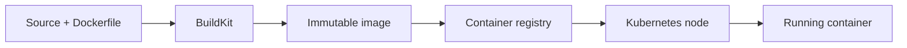
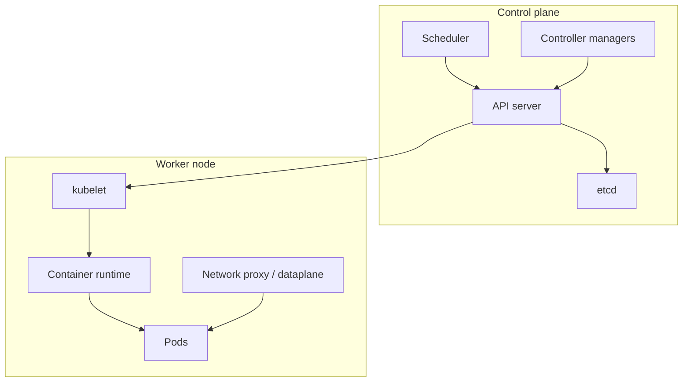
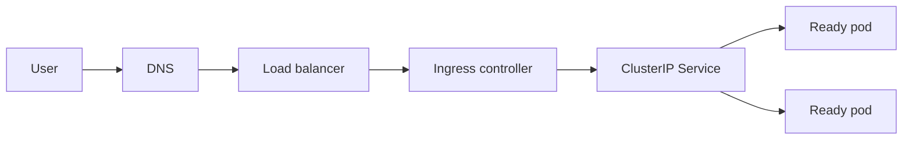
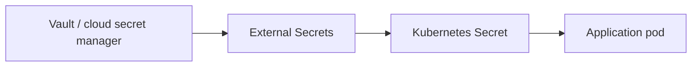
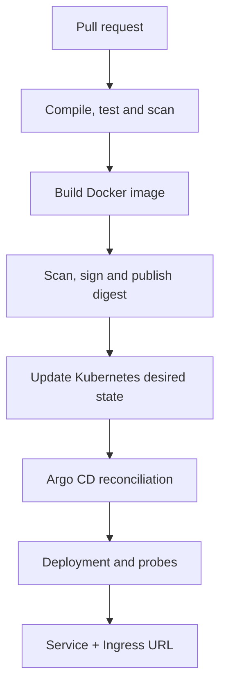

# Docker and Kubernetes Fundamentals for CI/CD Engineers

## 1. Purpose and expected interview level

This page is focused study material for an engineer presenting approximately **three years of CI/CD experience**. At that level, an interviewer normally expects more than definitions. You should be able to:

- explain how source code becomes a container image and then a running pod;
- write or review a secure multi-stage Dockerfile;
- understand the Kubernetes control plane and worker-node responsibilities;
- choose the correct Kubernetes workload and networking objects;
- diagnose build, image-pull, scheduling, probe, Service and Ingress failures;
- explain how CI publishes immutable artifacts and how Argo CD deploys them;
- discuss production security, scaling, rollback and operational trade-offs.

This guide complements the [Complete CI/CD Pipeline](complete-ci-cd-pipeline.md).

---

## 2. Container fundamentals

A container is an isolated operating-system process packaged with the application and its runtime dependencies. Containers share the host kernel; a virtual machine normally includes its own guest operating system and kernel.

| Concern | Container | Virtual machine |
|---|---|---|
| Isolation | Process-level namespaces and cgroups | Hypervisor and guest OS |
| Startup | Usually seconds or less | Usually slower |
| Size | Commonly MBs or hundreds of MBs | Commonly GBs |
| Kernel | Shared with host | Separate guest kernel |
| Portability | OCI image and runtime | VM image and hypervisor |
| Security boundary | Lighter; requires hardening | Generally stronger boundary |

Containers improve consistency between environments, but they do not remove the need for configuration management, security scanning, observability or resource governance.

### Core Linux mechanisms

- **Namespaces** isolate process IDs, networks, mounts, hostnames and users.
- **Control groups (cgroups)** limit and account for CPU, memory and other resources.
- **Layered filesystems** reuse read-only image layers and add a writable container layer.
- **Capabilities and seccomp** reduce the Linux privileges available to a process.

---

## 3. Docker architecture and object lifecycle

Docker commonly involves:

- Docker client: receives commands such as `docker build` and `docker run`;
- Docker daemon: builds images and manages containers, networks and volumes;
- registry: stores and distributes images;
- image: immutable, layered application package;
- container: runtime instance of an image;
- volume: persistent storage managed outside the container writable layer;
- network: communication boundary connecting containers.



### Image versus container

An image is a reusable template. A container is a running or stopped instance created from that image. Deleting a container does not delete the image. Data written only to the container's writable layer is lost when that container is replaced.

### OCI and container runtimes

OCI standards define image and runtime formats. Kubernetes uses a CRI-compatible runtime, commonly containerd or CRI-O. Kubernetes does not require the Docker daemon. Docker-built OCI images can still run through containerd.

---

## 4. Dockerfile design for production

A good Dockerfile should create a small, reproducible and least-privileged runtime image.

### Multi-stage Java example

```dockerfile
FROM eclipse-temurin:21-jdk AS builder
WORKDIR /workspace
COPY gradlew settings.gradle build.gradle ./
COPY gradle ./gradle
RUN ./gradlew dependencies --no-daemon
COPY src ./src
RUN ./gradlew clean bootJar --no-daemon

FROM eclipse-temurin:21-jre
RUN useradd --system --uid 10001 appuser
WORKDIR /app
COPY --from=builder /workspace/build/libs/*.jar application.jar
USER 10001
EXPOSE 8080
ENTRYPOINT ["java", "-jar", "/app/application.jar"]
```

Production considerations:

- use trusted, maintained base images;
- pin versions or digests according to the organization's update policy;
- keep compilers and build tools out of the runtime stage;
- run as a non-root user;
- copy dependency descriptors before source code to improve cache reuse;
- use exec-form `ENTRYPOINT` so signals reach the application correctly;
- exclude secrets, Git metadata and build output with `.dockerignore`;
- never bake environment-specific configuration or credentials into the image;
- scan the final runtime image, not only the source tree;
- rebuild regularly because a previously clean base image can later receive CVEs.

### Build context and layer cache

Every Dockerfile instruction normally creates a layer. When an early layer changes, later layers may need rebuilding. Stable dependency files should be copied before frequently changing source files.

Avoid:

- copying the whole repository before dependency resolution;
- installing unnecessary utilities;
- placing secret values in `ARG` or `ENV`;
- using mutable `:latest` tags for controlled deployment;
- running package-manager update and install operations in unrelated layers;
- using a shell process that fails to forward termination signals.

### Build-time versus runtime configuration

| Type | Examples | Location |
|---|---|---|
| Build-time | dependency version, compilation flag | CI/build arguments, never secrets |
| Runtime non-secret | profile, endpoint, log level | ConfigMap/environment |
| Runtime secret | passwords, API keys, client secrets | Secret manager/Kubernetes Secret reference |

Build once and promote the same immutable image through dev, UAT and production.

---

## 5. Docker networking and storage

### Common network modes

- **Bridge:** default single-host container network.
- **Host:** container shares the host network namespace; less isolation.
- **None:** no external network interface.
- **Overlay:** multi-host networking, usually provided by an orchestrator.

In Docker Compose, services on the same user-defined network resolve one another by service name. `localhost` inside a container refers to that container, not another service or the host.

### Port publishing

`EXPOSE 8080` documents the intended container port; it does not publish the port to the host. `docker run -p 8081:8080 image` maps host port 8081 to container port 8080.

### Storage

- **Writable container layer:** temporary and tied to the container.
- **Named volume:** persistent data managed by Docker.
- **Bind mount:** maps a host path; useful in development but host-dependent.
- **tmpfs:** memory-backed temporary storage.

Databases require persistent storage, backup and recovery design. A volume alone is not a backup.

---

## 6. Essential Docker commands

```bash
docker build -t interview-orchestrator:dev .
docker images
docker run --rm -p 8080:8080 interview-orchestrator:dev
docker ps
docker logs <container>
docker exec -it <container> sh
docker inspect <container>
docker stats
docker history interview-orchestrator:dev
docker network ls
docker volume ls
docker compose up -d
docker compose ps
docker compose logs -f <service>
```

Useful diagnostic sequence:

1. confirm the image exists and has the expected tag/digest;
2. inspect container state and exit code;
3. read current logs;
4. check environment variables and mounted configuration without exposing secrets;
5. verify process, listening port and network path;
6. inspect CPU/memory pressure;
7. reproduce from a clean image build.

---

## 7. Kubernetes purpose and cluster architecture

Kubernetes maintains the desired state of containerized workloads. You declare the required replicas, image, configuration, networking and policies; controllers continuously reconcile actual state toward that declaration.



### Control-plane components

| Component | Responsibility |
|---|---|
| API server | Authenticates, authorizes and validates API requests; cluster entry point |
| etcd | Strongly consistent storage for cluster desired and observed state |
| Scheduler | Selects a suitable node for an unscheduled pod |
| Controller manager | Runs reconciliation loops for Deployments, Nodes and other resources |
| Cloud controller manager | Integrates cloud load balancers, nodes and routes where applicable |

### Worker-node components

| Component | Responsibility |
|---|---|
| kubelet | Ensures assigned pods and containers run as declared |
| container runtime | Pulls images and runs containers |
| network dataplane | Implements Service traffic forwarding |
| CNI plugin | Provides pod networking and often NetworkPolicy enforcement |
| CSI plugin | Integrates storage systems |

A production control plane should be highly available, secured and backed up. etcd backup and restore must be tested, not merely configured.

---

## 8. Kubernetes declarative model

Kubernetes resources contain:

- `apiVersion` and `kind`;
- `metadata`, including name, namespace, labels and annotations;
- `spec`: desired state;
- `status`: observed state reported by the system.

Apply declarative configuration rather than relying on undocumented manual commands. In a GitOps model, Git is the authoritative desired state and Argo CD performs reconciliation.

### Labels, selectors and annotations

- Labels identify and group resources.
- Selectors connect objects, such as a Service to pods.
- Annotations store non-identifying metadata used by tools and controllers.

Selectors must be designed carefully because changing immutable workload selectors may require resource replacement.

---

## 9. Workload objects

### Pod

The smallest deployable unit. Containers in a pod share its network identity and can share volumes. Pods are ephemeral and normally managed by a controller rather than created directly.

### Deployment and ReplicaSet

A Deployment manages stateless replicas and rolling updates. It creates ReplicaSets, which maintain the requested pod count.

### StatefulSet

Use for workloads needing stable identities, ordered lifecycle or per-replica persistent storage. It does not make a database highly available by itself; application-level replication and operational procedures remain necessary.

### DaemonSet

Runs a pod on every eligible node, commonly for log agents, security agents and node monitoring.

### Job and CronJob

A Job runs finite work to completion. A CronJob schedules Jobs. Database migration may use a carefully controlled Job, although concurrency and rollback behavior must be explicitly designed.

| Requirement | Object |
|---|---|
| Stateless API replicas | Deployment |
| Broker/database with stable identity | StatefulSet or managed service/operator |
| Node-level monitoring agent | DaemonSet |
| One-time migration | Job |
| Scheduled maintenance | CronJob |

---

## 10. Scheduling, capacity and availability

The scheduler considers resource requests, node selectors, affinity, topology constraints, taints/tolerations and current capacity.

### Requests and limits

- Request is used for scheduling and represents reserved capacity.
- CPU limit throttles excessive CPU.
- Memory limit can cause an OOM kill when exceeded.
- Missing requests make capacity planning and autoscaling less reliable.
- Unrealistic limits can cause throttling, instability or poor utilization.

### Placement controls

- **nodeSelector/node affinity:** require or prefer certain nodes;
- **pod anti-affinity:** spread replicas away from one another;
- **topology spread constraints:** distribute across nodes or zones;
- **taints/tolerations:** keep general workloads away from dedicated nodes;
- **PodDisruptionBudget:** limits simultaneous voluntary disruption.

A PDB does not protect against involuntary node failure and does not create extra capacity.

---

## 11. Kubernetes networking

Every pod receives a cluster network identity. Pods are replaceable, so stable access uses Services.

### Service types

| Type | Use |
|---|---|
| ClusterIP | Internal stable virtual IP and DNS |
| NodePort | Exposes a port on each node; often a building block |
| LoadBalancer | Requests an external load balancer |
| ExternalName | DNS alias to an external name |
| Headless Service | Direct pod DNS, commonly with StatefulSets |

A Service selects ready pods through labels and publishes endpoint information. If a Service has no endpoints, check selectors and readiness before blaming Ingress.

### Ingress

An Ingress defines HTTP/HTTPS host and path rules. An Ingress Controller—such as NGINX or Traefik—implements those rules.



Gateway API is a newer, more expressive Kubernetes networking API and may be preferred by some platforms. In interviews, explain the platform's chosen standard rather than claiming Ingress is always the only option.

### NetworkPolicy

NetworkPolicy provides allow-list network controls when supported by the CNI plugin. A common Zero Trust posture is default deny, followed by narrowly scoped ingress and egress rules.

---

## 12. Configuration, secrets and storage

### ConfigMap and Secret

ConfigMaps store non-sensitive configuration. Secrets store sensitive values, but standard Kubernetes Secrets are only Base64-encoded unless encryption at rest and proper key management are configured.

Preferred enterprise flow:



Use least-privilege access, rotation, audit trails and short-lived identities where possible. Avoid committing secret values to Git.

### Persistent storage

- PersistentVolume represents storage capacity.
- PersistentVolumeClaim requests storage.
- StorageClass defines dynamic provisioning behavior.
- StatefulSet volumeClaimTemplates create per-replica claims.

Understand access modes, reclaim policies, snapshots, zone constraints and application-consistent backup. Persistent storage is not automatically portable across clusters or regions.

---

## 13. Health probes and lifecycle

| Probe | Purpose | Result of failure |
|---|---|---|
| Startup | Protects slow startup from premature liveness failure | Container eventually restarted |
| Readiness | Determines whether the pod should receive Service traffic | Pod removed from endpoints |
| Liveness | Detects an unrecoverably stuck process | Container restarted |

Guidelines:

- readiness may check critical ability to serve, but should not flap because of a minor optional dependency;
- liveness should test local process health and should not depend on every downstream service;
- startup probe should cover legitimate initialization time;
- add graceful shutdown, pre-stop handling where needed and adequate termination grace;
- validate that Spring Boot stops accepting traffic and drains in-flight requests during rollout.

---

## 14. Deployment, scaling and rollback

### Rolling update

A Deployment gradually replaces old pods with new pods. Safety depends on:

- readiness probes;
- `maxUnavailable` and `maxSurge`;
- sufficient cluster capacity;
- backward-compatible APIs and database schema;
- graceful termination;
- observability and smoke tests.

### Autoscaling

- HPA changes pod replica count from resource or custom metrics.
- VPA recommends or adjusts pod resources, depending on mode.
- Cluster Autoscaler or cloud equivalents change node capacity.
- KEDA can scale from event sources such as Kafka lag.

Autoscaling does not fix inefficient code, downstream bottlenecks or an incorrect partitioning strategy.

### Rollback

`kubectl rollout undo` can restore an earlier ReplicaSet, but GitOps may reconcile back to the Git-declared version. The durable rollback is a Git revert or promotion of the previous image digest. Database changes must remain backward compatible.

---

## 15. Kubernetes security fundamentals

A three-year CI/CD engineer should be comfortable with:

- RBAC and least-privilege ServiceAccounts;
- namespace and workload isolation;
- non-root containers and read-only root filesystems;
- dropping Linux capabilities;
- seccomp profiles;
- image vulnerability scanning, signing and admission policy;
- NetworkPolicies;
- external secret management;
- protected API access and audit logs;
- resource quotas and LimitRanges;
- avoiding privileged pods, host networking and host-path mounts;
- patching nodes, runtimes and Kubernetes versions;
- Pod Security Standards or equivalent policy enforcement.

Example security context:

```yaml
securityContext:
  runAsNonRoot: true
  runAsUser: 10001
  allowPrivilegeEscalation: false
  readOnlyRootFilesystem: true
  capabilities:
    drop:
      - ALL
  seccompProfile:
    type: RuntimeDefault
```

The application may need writable `emptyDir` mounts for specific temporary directories when the root filesystem is read-only.

---

## 16. Essential kubectl commands

```bash
kubectl config current-context
kubectl cluster-info
kubectl get nodes -o wide
kubectl get all -n online-interview
kubectl get pods -n online-interview -o wide
kubectl describe pod <pod> -n online-interview
kubectl logs <pod> -n online-interview
kubectl logs <pod> -c <container> --previous -n online-interview
kubectl get events -n online-interview --sort-by=.metadata.creationTimestamp
kubectl get deploy,rs,pods -n online-interview
kubectl rollout status deployment/<name> -n online-interview
kubectl rollout history deployment/<name> -n online-interview
kubectl get svc,endpointslices -n online-interview
kubectl get ingress -n online-interview
kubectl auth can-i get secrets --as=system:serviceaccount:<ns>:<sa> -n <ns>
kubectl top nodes
kubectl top pods -n online-interview
kubectl kustomize platform/kubernetes/overlays/dev
kubectl diff -k platform/kubernetes/overlays/dev
```

Do not make uncontrolled live edits in a GitOps-managed cluster. Diagnose with `get`, `describe`, logs, events and diffs; fix desired state in Git.

---

## 17. Troubleshooting by symptom

| Symptom | Meaning | Important checks |
|---|---|---|
| Pending | Pod has not been scheduled | Events, requests, taints, affinity, PVC, quotas |
| ImagePullBackOff | Image pull repeatedly fails | Image name/digest, registry auth, architecture, network |
| CrashLoopBackOff | Container starts and repeatedly exits | Current/previous logs, command, config, dependency, OOM |
| OOMKilled | Container exceeded available/limited memory | Limits, heap/container awareness, memory leak, load |
| Running but not Ready | Readiness probe fails | Probe path/port, dependencies, startup time |
| Service unavailable | No healthy routing target | Selector, EndpointSlice, targetPort, readiness |
| Ingress 404 | Rule/controller mismatch | Host, path, ingressClass, controller logs |
| Ingress 502/503 | Backend unavailable or port mismatch | Service endpoints, ports, pod readiness |
| Evicted | Node resource pressure or policy | Node conditions, ephemeral storage, requests |
| Argo CD OutOfSync | Git and live state differ | Rendered manifests, ignored differences, manual drift |
| Argo CD Degraded | Managed workload is unhealthy | Resource tree, events, probes and rollout |

### Layer-by-layer diagnosis

```text
Git change
→ CI result
→ image and digest in registry
→ manifest promotion
→ Argo CD sync/diff
→ scheduler and Kubernetes events
→ container logs and probes
→ Service selectors/endpoints
→ Ingress controller
→ DNS/TLS
→ external smoke test
```

This ordering prevents circular troubleshooting.

---

## 18. How Docker and Kubernetes fit into CI/CD



Responsibilities:

| Stage | Owner |
|---|---|
| Compile, unit/integration test | CI engine |
| Build and scan OCI image | CI engine |
| Store immutable image | Registry |
| Define desired runtime state | Kubernetes manifests/Kustomize |
| Reconcile desired state | Argo CD |
| Schedule and run workloads | Kubernetes |
| Route stable external traffic | Service and Ingress Controller |
| Verify user journey | Smoke/synthetic tests and observability |

CI should not rebuild the artifact separately for each environment. Promote the same digest.

---

## 19. Production responsibilities at three years' experience

You should be ready to describe real contributions such as:

- maintaining Dockerfiles and reducing image size/build time;
- implementing CI tests and vulnerability gates;
- publishing versioned images to a registry;
- managing Kustomize or Helm environment configuration;
- investigating failed pods using events, logs and probes;
- configuring Deployments, Services, Ingress and TLS;
- tuning requests/limits with metrics;
- supporting rollout, rollback and release verification;
- resolving ImagePullBackOff, CrashLoopBackOff and routing failures;
- applying RBAC, security contexts and secret-management practices;
- monitoring deployment health and collaborating with developers/platform teams.

Do not claim cluster-administrator ownership if your work was application delivery. State your scope honestly:

> I worked mainly at the application-platform boundary: containerization, pipeline automation, Kubernetes workload manifests, Argo CD promotion, rollout verification and first-line production diagnosis. The central platform team owned control-plane upgrades, CNI and enterprise cluster governance, and I collaborated with them when incidents crossed those boundaries.

That answer sounds experienced and credible.

---

## 20. Interview questions and concise answers

### What happens after `docker build`?

Docker/BuildKit reads the build context and Dockerfile, executes stages, reuses valid cached layers, produces a content-addressed OCI image and tags it locally. CI then scans and pushes it; the registry assigns a manifest digest used for immutable deployment.

### Why should a container be stateless?

Replaceable replicas enable rescheduling, scaling and rolling updates. Durable state should use external data stores or persistent volumes with explicit availability, backup and recovery design.

### Why is a pod not the same as a container?

A pod is Kubernetes' scheduling unit and may contain multiple tightly coupled containers that share network identity and volumes.

### Deployment versus StatefulSet?

Deployment suits interchangeable stateless replicas. StatefulSet adds stable identity, ordered lifecycle and stable volume association; it does not automatically solve database replication.

### Service versus Ingress?

A Service provides stable access to pods, normally inside the cluster. Ingress defines external HTTP/HTTPS routing rules implemented by an Ingress Controller.

### Readiness versus liveness?

Readiness controls traffic eligibility. Liveness decides whether to restart a stuck container. Mixing them can cause traffic failures or restart storms.

### Why use requests and limits?

Requests guide scheduling and capacity reservation. Limits constrain runtime consumption. They must be based on observed behavior because incorrect values cause waste, throttling or OOM failures.

### Why do pods remain Pending?

Common reasons include insufficient CPU/memory, unmatched node affinity, untolerated taints, unbound PVCs, topology constraints or quota violations. The scheduler events reveal the cause.

### Why ImagePullBackOff?

The node cannot retrieve the image: wrong name/digest, missing registry permission, rate limiting, network/DNS issue or incompatible platform. Inspect pod events first.

### Why use Argo CD instead of `kubectl apply` from CI?

Argo CD uses pull-based reconciliation, limits production credentials in CI, detects drift and creates a Git-auditable desired state. CI remains responsible for producing the trusted artifact.

### How do you roll back?

Promote or revert to the previous immutable digest in Git and let Argo CD reconcile. Verify schema compatibility, rollout health and smoke tests.

### Does Kubernetes provide zero downtime automatically?

No. It provides mechanisms, but zero-downtime behavior requires multiple replicas, capacity, correct probes, rolling-update settings, graceful shutdown and backward-compatible contracts/schema.

---

## 21. A two-minute interview answer

> In our CI/CD setup, each service has a multi-stage Dockerfile. Pull requests run compilation, tests, static checks, container builds and security scans. After merge, CI builds the image from the exact Git commit, generates supply-chain metadata, scans it and publishes it to the registry. We deploy by immutable digest rather than latest tags.
>
> Kubernetes runs the application through Deployments for stateless services, ClusterIP Services for stable internal access and Ingress for host-based external URLs. Every workload has requests and limits, startup/readiness/liveness probes, non-root security settings and externalized configuration. Argo CD watches the environment manifests and reconciles the cluster, so CI does not need broad production-cluster credentials.
>
> During support, I troubleshoot layer by layer: CI result, registry digest, Argo sync state, Kubernetes events, pod logs and probes, Service endpoints, then Ingress, DNS and TLS. I have handled typical failures such as ImagePullBackOff, CrashLoopBackOff, readiness failures and 503 responses. Rollback means reverting the desired image digest in Git and verifying that database migrations remain backward compatible. The platform team owns the Kubernetes control plane, while I own containerization, workload configuration, deployment automation and application-level operational readiness.

---

## 22. Final revision checklist

Before an interview, confirm you can explain without memorized jargon:

- [ ] container versus VM, image versus container and OCI runtime;
- [ ] multi-stage Dockerfile, caching, non-root and signal handling;
- [ ] Docker networking, port mapping and persistent storage;
- [ ] Kubernetes control plane and worker-node components;
- [ ] Pod, Deployment, StatefulSet, DaemonSet, Job and CronJob;
- [ ] requests/limits, scheduling, affinity, taints and disruption budgets;
- [ ] Service, EndpointSlice, Ingress, DNS and NetworkPolicy;
- [ ] ConfigMap, Secret, external secret management and PVC;
- [ ] startup, readiness and liveness probes;
- [ ] rolling update, autoscaling, immutable-digest promotion and rollback;
- [ ] RBAC, security context, image scanning/signing and policy;
- [ ] troubleshooting from CI through public application URL;
- [ ] the boundary between application CI/CD ownership and platform administration.

The strongest interview answer connects each concept to a deployment you operated and a failure you diagnosed.
