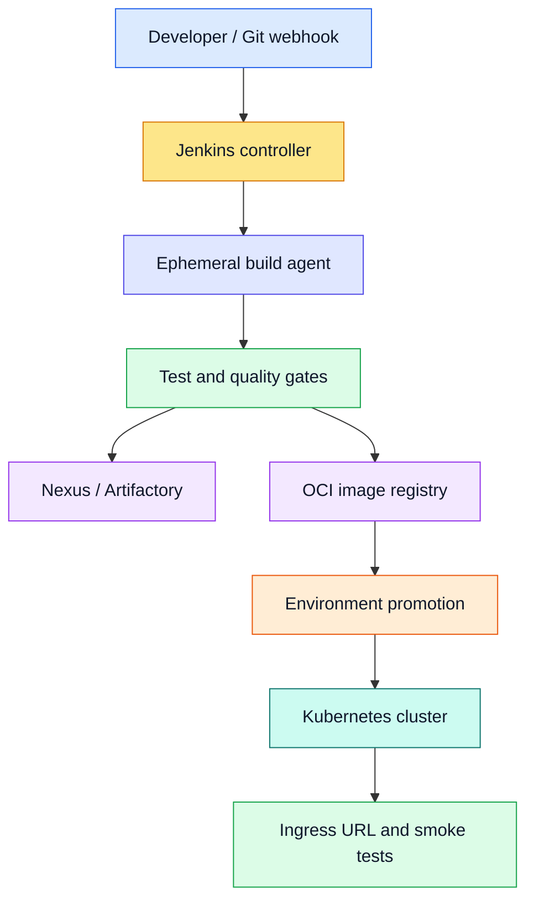
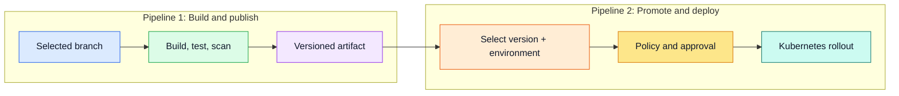
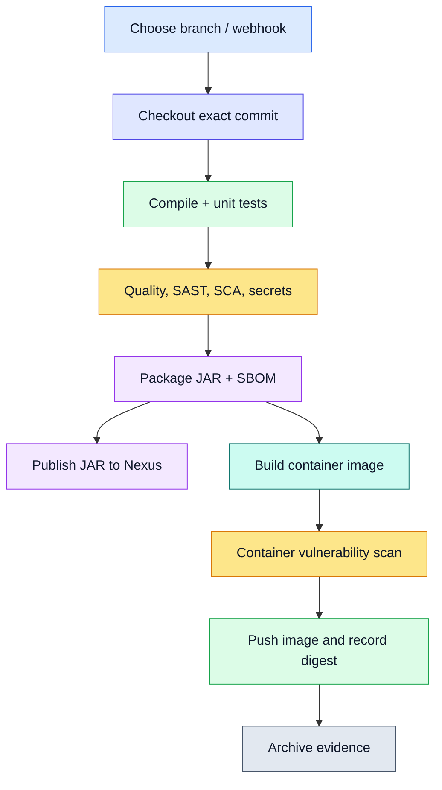
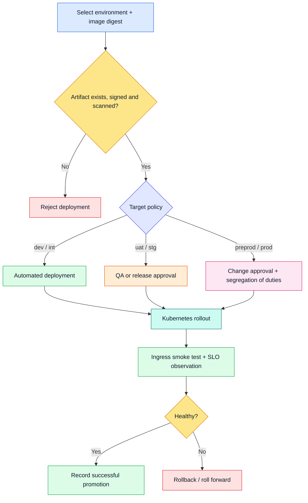
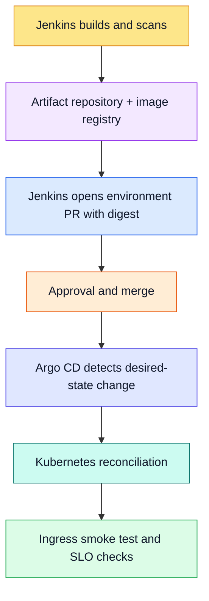

# Jenkins CI/CD Pipeline: Branch Build, Artifact Publishing and Environment Deployment

## 1. Purpose

This chapter is interview-ready study material for designing and explaining a production Jenkins pipeline. It provides two complete examples:

1. **Branch CI pipeline:** check out a selected branch, compile, test, scan, package, generate evidence, publish the binary artifact to Nexus or Artifactory, build and scan a container image, and push it to an OCI registry.
2. **Environment deployment pipeline:** select `dev`, `int`, `uat`, `stg`, `preprod`, or `prod`, promote an existing immutable artifact, apply environment policy and approvals, deploy to Kubernetes, verify health through Ingress, and roll back safely.

The most important design rule is:

> Build once, assign an immutable version, and promote exactly the same artifact through every environment. Never rebuild separately for UAT, staging, pre-production, or production.

This design applies to Java/Spring Boot services and can be extended to Python and React components.

---

## 2. Jenkins in the delivery architecture

Jenkins is an automation server. A **controller** schedules work and stores pipeline configuration; **agents** execute builds in isolated workspaces. Production teams normally use ephemeral Docker or Kubernetes agents instead of compiling on the controller.



### Responsibility boundaries

| Component | Responsibility |
|---|---|
| Git provider | Source, pull requests, reviews, protected branches and webhooks |
| Jenkins controller | Pipeline orchestration, queueing, credentials references and audit trail |
| Jenkins agent | Compile, test, scan, package and container build |
| SonarQube | Static analysis, maintainability and quality gate |
| Nexus/Artifactory | Versioned JAR, WAR, ZIP, SBOM and build metadata |
| OCI registry | Immutable container images such as GHCR, ECR, Harbor or Artifactory |
| Kubernetes | Runtime scheduling, rollout, health and scaling |
| Ingress | Stable external HTTP/HTTPS URL |
| Argo CD, when used | Pull-based GitOps reconciliation instead of direct Jenkins deployment |

---

## 3. Two-pipeline separation

Separating build from deployment makes promotion repeatable and prevents production from compiling unreviewed or different bytes.



The deployment pipeline accepts an **artifact version or image digest**, not a source branch. Branch selection belongs to CI; environment selection belongs to CD.

---

## 4. Prerequisites and Jenkins configuration

### Recommended plugins

- Pipeline and Pipeline: Stage View
- Git and GitHub Branch Source
- Credentials Binding
- Docker Pipeline or Kubernetes plugin
- SonarQube Scanner
- JUnit and JaCoCo support
- HTML Publisher when scan reports need retention
- Lockable Resources for serialized shared-environment deployment
- Role Strategy and Audit Trail

Avoid installing plugins without ownership and patching processes. Every plugin increases the controller's supply-chain and maintenance surface.

### Credentials

Create credential IDs and refer to them from the pipeline; never embed values in a `Jenkinsfile`.

| Credential ID | Type | Purpose |
|---|---|---|
| `scm-read-token` | Username/token or app credential | Private repository checkout |
| `nexus-publisher` | Username/password | Binary artifact publication |
| `registry-publisher` | Username/token | Container registry push |
| `sonarqube-token` | Secret text | SonarQube analysis |
| `kubeconfig-dev` | Secret file | Direct deployment to dev, if allowed |
| `kubeconfig-nonprod` | Secret file | INT/UAT/STG/PREPROD deployment |
| `kubeconfig-prod` | Secret file | Production deployment with restricted RBAC |

Prefer workload identity, OIDC or short-lived credentials when the target platform supports them. Scope production credentials to the required namespace and actions.

### Agent requirements

- JDK 21 and Gradle wrapper support
- Docker BuildKit, Kaniko, Buildah or another isolated OCI builder
- Trivy and a secret scanner
- `kubectl`, Kustomize and optionally Helm
- Network access only to approved source, artifact, registry and cluster endpoints
- An ephemeral workspace cleaned after the job

Do not mount an unrestricted host Docker socket into untrusted builds. It is effectively root-level access to the worker.

---

## 5. Version and artifact strategy

A useful immutable version is:

```text
<semantic-version>-<short-git-sha>-<build-number>
```

Example:

```text
1.8.0-a13f82c-417
```

Store this version consistently in:

- JAR/WAR filename and Maven coordinates;
- container image tag;
- SBOM and provenance;
- deployment annotations;
- logs, metrics and `/actuator/info`;
- release records.

Release artifacts should be immutable. A repository may allow overwrite in a snapshot area, but production promotion must use a release repository or content digest that cannot silently change.

---

## 6. Example 1 — branch build, scan and artifact publication

### Flow



### Declarative Jenkinsfile

This example is intentionally explicit for study. Adapt repository URLs, tool names and Gradle tasks to the application.

```groovy
pipeline {
    agent { label 'java21-docker' }

    options {
        timestamps()
        ansiColor('xterm')
        disableConcurrentBuilds(abortPrevious: true)
        buildDiscarder(logRotator(numToKeepStr: '30'))
        timeout(time: 45, unit: 'MINUTES')
        skipDefaultCheckout(true)
    }

    parameters {
        string(name: 'GIT_BRANCH', defaultValue: 'main',
               description: 'Branch to build; production releases must originate from a protected branch')
        booleanParam(name: 'PUBLISH_ARTIFACT', defaultValue: true,
                     description: 'Publish trusted artifact after all gates pass')
    }

    environment {
        APP_NAME       = 'interview-orchestrator'
        NEXUS_BASE_URL = 'https://nexus.example.com/repository/maven-releases'
        IMAGE_REPO     = 'ghcr.io/skpandey15/java-ai-mcp-orchestrator'
        SONAR_INSTANCE = 'enterprise-sonarqube'
    }

    stages {
        stage('Checkout') {
            steps {
                checkout([$class: 'GitSCM',
                    branches: [[name: "*/${params.GIT_BRANCH}"]],
                    userRemoteConfigs: [[
                        url: 'https://github.com/Skpandey15/Java_AI_MCP.git',
                        credentialsId: 'scm-read-token'
                    ]]
                ])
                script {
                    env.GIT_SHA = sh(returnStdout: true,
                        script: 'git rev-parse HEAD').trim()
                    env.SHORT_SHA = env.GIT_SHA.take(8)
                    env.ARTIFACT_VERSION = "1.0.${env.BUILD_NUMBER}-${env.SHORT_SHA}"
                    currentBuild.displayName = "#${env.BUILD_NUMBER} ${params.GIT_BRANCH} ${env.SHORT_SHA}"
                }
            }
        }

        stage('Compile and Unit Test') {
            steps {
                dir('interview-orchestrator') {
                    sh './gradlew --no-daemon clean test'
                }
            }
            post {
                always {
                    junit testResults: 'interview-orchestrator/build/test-results/test/*.xml',
                          allowEmptyResults: false
                    recordCoverage tools: [[parser: 'JACOCO']],
                                   id: 'java-coverage', name: 'Java coverage'
                }
            }
        }

        stage('Secrets and Dependency Scan') {
            parallel {
                stage('Secrets') {
                    steps {
                        sh 'gitleaks detect --source . --no-banner --redact'
                    }
                }
                stage('Dependencies') {
                    steps {
                        dir('interview-orchestrator') {
                            sh './gradlew --no-daemon dependencyCheckAnalyze'
                        }
                    }
                }
            }
        }

        stage('SonarQube') {
            steps {
                withSonarQubeEnv(env.SONAR_INSTANCE) {
                    dir('interview-orchestrator') {
                        sh './gradlew --no-daemon sonar'
                    }
                }
            }
        }

        stage('Quality Gate') {
            steps {
                timeout(time: 10, unit: 'MINUTES') {
                    waitForQualityGate abortPipeline: true
                }
            }
        }

        stage('Package and SBOM') {
            steps {
                dir('interview-orchestrator') {
                    sh './gradlew --no-daemon bootJar cyclonedxBom'
                }
                archiveArtifacts artifacts: 'interview-orchestrator/build/libs/*.jar, interview-orchestrator/build/reports/bom.*',
                                 fingerprint: true
            }
        }

        stage('Publish Binary Artifact') {
            when { expression { params.PUBLISH_ARTIFACT } }
            steps {
                withCredentials([usernamePassword(
                    credentialsId: 'nexus-publisher',
                    usernameVariable: 'NEXUS_USER',
                    passwordVariable: 'NEXUS_PASSWORD'
                )]) {
                    sh '''
                      set +x
                      JAR_FILE=$(find interview-orchestrator/build/libs -name '*.jar' -type f | head -1)
                      curl --fail --show-error --silent \
                        --user "$NEXUS_USER:$NEXUS_PASSWORD" \
                        --upload-file "$JAR_FILE" \
                        "$NEXUS_BASE_URL/com/example/$APP_NAME/$ARTIFACT_VERSION/$APP_NAME-$ARTIFACT_VERSION.jar"
                    '''
                }
            }
        }

        stage('Build and Scan Image') {
            steps {
                sh '''
                  docker build --pull \
                    --label org.opencontainers.image.revision="$GIT_SHA" \
                    --tag "$IMAGE_REPO:$ARTIFACT_VERSION" \
                    --file interview-orchestrator/Dockerfile .
                  trivy image --exit-code 1 --severity HIGH,CRITICAL \
                    --ignore-unfixed "$IMAGE_REPO:$ARTIFACT_VERSION"
                '''
            }
        }

        stage('Push Container Image') {
            when { expression { params.PUBLISH_ARTIFACT } }
            steps {
                withCredentials([usernamePassword(
                    credentialsId: 'registry-publisher',
                    usernameVariable: 'REGISTRY_USER',
                    passwordVariable: 'REGISTRY_TOKEN'
                )]) {
                    sh '''
                      set +x
                      echo "$REGISTRY_TOKEN" | docker login ghcr.io -u "$REGISTRY_USER" --password-stdin
                      docker push "$IMAGE_REPO:$ARTIFACT_VERSION"
                      docker inspect --format='{{index .RepoDigests 0}}' \
                        "$IMAGE_REPO:$ARTIFACT_VERSION" | tee image-digest.txt
                      docker logout ghcr.io
                    '''
                }
                archiveArtifacts artifacts: 'image-digest.txt', fingerprint: true
            }
        }
    }

    post {
        success {
            echo "Published ${env.APP_NAME}:${env.ARTIFACT_VERSION} from ${env.GIT_SHA}"
        }
        unsuccessful {
            echo 'No artifact should be promoted from this failed or unstable build.'
        }
        always {
            cleanWs(deleteDirs: true, disableDeferredWipeout: true)
        }
    }
}
```

### Notes about the example

- In a real Gradle/Maven project, prefer native repository publishing (`maven-publish`, `nexus-publish`, or `mvn deploy`) over constructing a raw Nexus URL.
- `docker push` prints a registry digest, but implementation should capture and validate the remote digest reliably with `docker buildx imagetools inspect`, `crane digest`, or registry APIs.
- A scanner policy should consider exploitability and documented exceptions, not merely a severity label.
- Jenkins archives are build evidence, not the long-term enterprise artifact repository.
- Feature branches may build snapshot artifacts; release publication must be restricted to protected branches or signed tags.

### Multibranch alternative

For a real repository, a **Multibranch Pipeline** automatically discovers branches and pull requests. Use `BRANCH_NAME` and webhook events instead of letting anyone type an arbitrary ref. This provides better status checks and reduces the chance of publishing from an untrusted branch.

---

## 7. Example 2 — parameterized higher-environment deployment

### Environment policy

| Environment | Typical trigger | Approval | Artifact policy | Deployment behavior |
|---|---|---|---|---|
| `dev` | Automatic after trusted main build | No | Snapshot or release candidate | Automatic |
| `int` | Automatic or selected | Optional | Same candidate | Integration tests |
| `uat` | Selected promotion | Product/QA | Same candidate | Business acceptance |
| `stg` | Selected promotion | Release team | Release candidate | Production-like verification |
| `preprod` | Selected promotion | Change/release owner | Exact production candidate | Final smoke/performance checks |
| `prod` | Explicit promotion | Two-person/change approval | Exact tested digest | Controlled rollout and observation |

Names vary by organization. What matters is the increasing evidence and control, not the label.

### Promotion flow



### Direct-deployment Jenkinsfile

This example shows Jenkins deploying directly with Kustomize. The GitOps alternative follows afterward.

```groovy
def environmentConfig(String target) {
    def configs = [
        dev:     [credential: 'kubeconfig-dev',     url: 'https://dev.interview.example.com'],
        int:     [credential: 'kubeconfig-nonprod', url: 'https://int.interview.example.com'],
        uat:     [credential: 'kubeconfig-nonprod', url: 'https://uat.interview.example.com'],
        stg:     [credential: 'kubeconfig-nonprod', url: 'https://stg.interview.example.com'],
        preprod: [credential: 'kubeconfig-nonprod', url: 'https://preprod.interview.example.com'],
        prod:    [credential: 'kubeconfig-prod',    url: 'https://interview.example.com']
    ]
    return configs[target]
}

pipeline {
    agent { label 'kubectl-kustomize' }

    options {
        timestamps()
        disableConcurrentBuilds()
        timeout(time: 30, unit: 'MINUTES')
        buildDiscarder(logRotator(numToKeepStr: '50'))
        skipDefaultCheckout(true)
    }

    parameters {
        choice(name: 'TARGET_ENV',
               choices: ['dev', 'int', 'uat', 'stg', 'preprod', 'prod'],
               description: 'Target deployment environment')
        string(name: 'IMAGE_DIGEST', defaultValue: '', trim: true,
               description: 'Required immutable image digest: sha256:...')
        string(name: 'RELEASE_VERSION', defaultValue: '', trim: true,
               description: 'Previously published artifact version')
        booleanParam(name: 'CONFIRM_PRODUCTION', defaultValue: false,
                     description: 'Additional guard for production deployment')
    }

    environment {
        APP_NAME   = 'interview-orchestrator'
        IMAGE_REPO = 'ghcr.io/skpandey15/java-ai-mcp-orchestrator'
        NAMESPACE  = 'online-interview'
    }

    stages {
        stage('Validate Request') {
            steps {
                script {
                    if (!(params.IMAGE_DIGEST ==~ /^sha256:[a-f0-9]{64}$/)) {
                        error('IMAGE_DIGEST must be a complete sha256 digest')
                    }
                    if (!params.RELEASE_VERSION) {
                        error('RELEASE_VERSION is required')
                    }
                    if (params.TARGET_ENV == 'prod' && !params.CONFIRM_PRODUCTION) {
                        error('CONFIRM_PRODUCTION must be selected for prod')
                    }
                    env.APPLICATION_URL = environmentConfig(params.TARGET_ENV).url
                    currentBuild.displayName = "#${BUILD_NUMBER} ${params.RELEASE_VERSION} → ${params.TARGET_ENV}"
                }
            }
        }

        stage('Verify Published Artifact') {
            steps {
                sh '''
                  crane digest "$IMAGE_REPO@$IMAGE_DIGEST" | grep -F "$IMAGE_DIGEST"
                  cosign verify "$IMAGE_REPO@$IMAGE_DIGEST" \
                    --certificate-identity-regexp='https://github.com/Skpandey15/Java_AI_MCP/.*' \
                    --certificate-oidc-issuer='https://token.actions.githubusercontent.com'
                '''
            }
        }

        stage('Checkout Deployment Configuration') {
            steps {
                git branch: 'main', credentialsId: 'scm-read-token',
                    url: 'https://github.com/Skpandey15/Java_AI_MCP.git'
                sh 'kustomize build "platform/kubernetes/overlays/$TARGET_ENV" > rendered.yaml'
                sh 'kubeconform -strict -summary rendered.yaml'
            }
        }

        stage('Approval') {
            when {
                expression { params.TARGET_ENV in ['uat', 'stg', 'preprod', 'prod'] }
            }
            steps {
                script {
                    def approvers = params.TARGET_ENV == 'prod' ? 'production-approvers' : 'release-approvers'
                    input message: "Deploy ${params.RELEASE_VERSION} to ${params.TARGET_ENV}?",
                          ok: 'Approve deployment',
                          submitter: approvers
                }
            }
        }

        stage('Deploy') {
            steps {
                script {
                    def config = environmentConfig(params.TARGET_ENV)
                    withCredentials([file(credentialsId: config.credential,
                                          variable: 'KUBECONFIG')]) {
                        sh '''
                          cd "platform/kubernetes/overlays/$TARGET_ENV"
                          kustomize edit set image \
                            "$APP_NAME=$IMAGE_REPO@$IMAGE_DIGEST"
                          kustomize build . | kubectl apply --server-side --field-manager=jenkins -f -
                          kubectl -n "$NAMESPACE" rollout status \
                            "deployment/$APP_NAME" --timeout=5m
                        '''
                    }
                }
            }
        }

        stage('Verify Through Ingress') {
            steps {
                retry(3) {
                    sh '''
                      curl --fail --silent --show-error \
                        --retry 3 --retry-all-errors \
                        "$APPLICATION_URL/actuator/health/readiness"
                    '''
                }
            }
        }

        stage('Record Promotion') {
            steps {
                writeFile file: 'promotion.json', text: """{
                  \"application\": \"${env.APP_NAME}\",
                  \"version\": \"${params.RELEASE_VERSION}\",
                  \"digest\": \"${params.IMAGE_DIGEST}\",
                  \"environment\": \"${params.TARGET_ENV}\",
                  \"jenkinsBuild\": \"${env.BUILD_URL}\"
                }"""
                archiveArtifacts artifacts: 'promotion.json', fingerprint: true
            }
        }
    }

    post {
        failure {
            echo 'Deployment failed. Notify owners and execute the approved rollback/runbook.'
        }
        always {
            archiveArtifacts artifacts: 'rendered.yaml', allowEmptyArchive: true
            cleanWs(deleteDirs: true, disableDeferredWipeout: true)
        }
    }
}
```

### Important production corrections

The sample is educational. A production implementation should also:

- resolve the registry digest before approval and display it to the approver;
- prevent skipping environments unless an emergency policy authorizes it;
- verify that the same digest passed required tests in the preceding environment;
- use Jenkins folders/RBAC so only authorized users can deploy higher environments;
- use `lock(resource: "${TARGET_ENV}")` to serialize shared-environment releases;
- run database migration as a controlled, backward-compatible stage or Kubernetes Job;
- retain deployment metadata in a release system, not only Jenkins logs;
- observe SLOs for a defined period after deployment;
- integrate change tickets for regulated production environments.

---

## 8. Jenkins direct deployment versus Jenkins plus Argo CD

There are two valid enterprise patterns.

| Concern | Jenkins deploys directly | Jenkins + Argo CD |
|---|---|---|
| Cluster access | Jenkins stores Kubernetes credentials | Argo CD has cluster access; Jenkins updates Git |
| Desired-state source | Pipeline execution and rendered manifest | Git repository |
| Drift detection | Additional tooling required | Continuous reconciliation |
| Rollback audit | Jenkins record plus deployment history | Git revert plus Argo history |
| Simplicity | Easier initially | Additional platform component |
| Enterprise GitOps | Limited | Strong |

For the architecture already documented in this handbook, **Jenkins should perform CI and promotion, while Argo CD performs CD**:



The CD Jenkinsfile then replaces `kubectl apply` with:

1. clone the environment repository;
2. update the Kustomize image digest for the selected environment;
3. create a signed commit on a promotion branch;
4. open a pull request containing test and scan evidence;
5. require environment-specific reviewers;
6. merge after approval;
7. wait for Argo CD Application health and run external smoke tests.

This keeps production credentials out of Jenkins and makes Git the authoritative desired state.

---

## 9. Artifact repository versus container registry

These are related but different.

| Repository | Stores | Example |
|---|---|---|
| Binary artifact repository | JAR, WAR, ZIP, npm package, Python wheel, SBOM | Nexus, JFrog Artifactory |
| OCI registry | Container image manifests and layers | GHCR, ECR, Harbor, Artifactory |
| Jenkins archive | Short-lived build evidence and reports | Jenkins controller/external artifact manager |

A Spring Boot service may publish both a JAR and a container image. Kubernetes normally deploys the container digest; the JAR remains useful for traceability, reuse, vulnerability analysis and non-container deployment models.

---

## 10. Deployment and rollback rules

### Pre-deployment

- validate artifact signature, digest, SBOM and scan status;
- validate manifests with Kustomize, schema checks and policy-as-code;
- verify namespace, quota and secret references;
- ensure database changes are expand-and-contract compatible;
- record change owner, approver, version and target.

### Deployment

- use readiness-gated rolling, blue/green or canary rollout;
- set resource requests/limits and disruption budgets;
- wait for Kubernetes rollout completion;
- never declare success only because `kubectl apply` returned zero.

### Post-deployment

- test through the actual Ingress URL;
- validate authentication and one critical business journey;
- inspect error rate, latency, saturation and pod restarts;
- add a deployment marker to dashboards;
- record the digest actually running in the cluster.

### Rollback

Redeploy the last known-good immutable digest or revert the GitOps promotion commit. Do not rebuild the old source. Application rollback does not automatically reverse database changes, so migrations must remain compatible with both versions.

---

## 11. Security and governance

- Protect the `Jenkinsfile` through pull-request review and CODEOWNERS.
- Do not expose secrets to untrusted fork or feature-branch builds.
- Mask credentials and disable command echo around sensitive operations.
- Use separate credentials and RBAC for non-production and production.
- Run builds on disposable least-privilege agents.
- Scan source, dependencies, secrets, IaC and final images.
- Generate SBOM and provenance; sign release images.
- Enforce protected production approvals outside the person who authored the change.
- Retain audit evidence: commit, Jenkins run, test results, artifact checksum/digest, approver, deployment and verification.
- Patch Jenkins core, Java runtime, plugins and agents regularly.

Jenkins' `input` step is useful, but production governance is stronger when combined with protected environments, external change management or a Git pull-request approval trail.

---

## 12. Shared libraries and maintainability

As pipelines grow, move reviewed reusable logic into a versioned Jenkins Shared Library:

```text
vars/
├── buildJavaService.groovy
├── scanContainer.groovy
├── publishArtifact.groovy
├── promoteEnvironment.groovy
└── verifyDeployment.groovy
src/org/example/pipeline/
resources/
```

Applications keep a short declarative contract:

```groovy
@Library('enterprise-pipeline@v3') _

enterpriseJavaPipeline(
    application: 'interview-orchestrator',
    javaVersion: 21,
    dockerfile: 'interview-orchestrator/Dockerfile'
)
```

Pin production jobs to a reviewed library version. Changing a shared library used by hundreds of applications is itself a production change and requires compatibility testing.

---

## 13. Common failures and troubleshooting

| Symptom | Likely cause | First checks |
|---|---|---|
| Webhook does not start job | Webhook, branch discovery or credential issue | Git event, multibranch scan and Jenkins log |
| Job remains queued | No matching/available agent | Label, executor capacity and Kubernetes agent events |
| Works locally, fails in Jenkins | Different JDK, clean checkout, permissions or missing file | Tool versions and workspace contents |
| Sonar gate waits forever | Missing webhook or task callback | SonarQube webhook and task ID |
| Nexus publication gets 401/403 | Credential or repository permission | Credential scope and target repository |
| Artifact version already exists | Mutable/reused release version | Version-generation and immutability policy |
| Registry push fails | Login, package permission or lowercase path | Token scopes and image name |
| Image scan fails | Vulnerability over policy threshold | CVE evidence, fixed version and exception process |
| Kubernetes deploy is forbidden | Insufficient RBAC | Service account and namespace RoleBinding |
| Rollout times out | Readiness, image pull, crash or resource shortage | Events, pod status and previous logs |
| Ingress smoke test fails | DNS, TLS, host/path, Service or endpoints | Ingress, certificate and EndpointSlices |
| Correct tag deploys wrong bytes | Mutable tag reuse | Deploy and verify immutable digest |

Troubleshoot in order:

```text
Git event → Jenkins queue → agent → checkout → tests/scans
→ artifact repository → registry digest → promotion record
→ Kubernetes events/pods → Service endpoints → Ingress/DNS/TLS
→ business smoke test and SLOs
```

---

## 14. Interview questions and concise answers

### Why split build and deployment pipelines?

The build pipeline creates a trusted immutable artifact once. The deployment pipeline promotes that exact artifact under environment-specific policy. This avoids rebuilding different bytes and supports separation of duties.

### Can Jenkins be both CI and CD?

Yes. Jenkins can build and directly deploy. In a GitOps design, Jenkins performs CI and changes environment Git, while Argo CD performs reconciliation-based CD.

### Why use Nexus/Artifactory if an image registry exists?

The binary repository stores language packages, JARs, SBOMs and other build outputs. The OCI registry stores deployable container images. Some platforms combine both capabilities, but the logical responsibilities remain distinct.

### How do you promote to production?

Select a previously published version and digest, validate its evidence and preceding-environment results, obtain protected approval, update the production desired state, observe the rollout, test through Ingress, and record the exact running digest.

### Why not rebuild for production?

A rebuild can change dependencies, timestamps, base images or tool output. It invalidates the evidence collected in lower environments. Promotion must use the already-tested immutable artifact.

### How are secrets managed?

Jenkins stores credential references, injects them only into the required stage, masks logs and uses least privilege. Prefer short-lived identity and external secret managers over long-lived static tokens.

### What is the rollback mechanism?

Redeploy the last known-good digest or revert the GitOps promotion commit. Verify through rollout and smoke tests. Database compatibility is handled independently through expand-and-contract migrations.

### How do you prevent two deployments colliding?

Disable concurrent job execution or lock a resource per environment. In GitOps, protected environment branches and Argo reconciliation also serialize the desired state.

### What would you monitor?

Jenkins queue time, agent provisioning, build duration and failure rate; artifact and scan results; rollout state; pod readiness/restarts; Ingress errors; and application SLOs correlated with version and digest.

---

## 15. Two-minute interview answer

> We separated CI from environment deployment. Our Jenkins multibranch pipeline starts from a webhook, checks out the exact commit on an ephemeral agent, compiles and runs unit and integration tests, publishes JUnit and JaCoCo results, runs secret, dependency and SonarQube gates, packages the service, generates an SBOM, and publishes a versioned JAR to Nexus. It then builds the final container, scans it, pushes it to the registry and records the immutable digest. Failed or unstable builds cannot be promoted.
>
> The deployment pipeline accepts an existing version and digest plus a selected environment: dev, integration, UAT, staging, pre-production or production. It verifies the published artifact and signature, renders and validates the environment's Kustomize overlay, then applies progressively stronger approvals. We deploy the same bytes through all environments, wait for the readiness-gated Kubernetes rollout and run smoke tests through the Ingress URL. Production also has segregation of duties and an observation window against SLOs.
>
> Jenkins can deploy directly with namespace-scoped credentials, but our preferred model is Jenkins plus Argo CD. Jenkins updates the environment repository through a reviewed promotion PR; Argo CD pulls the desired state and reconciles Kubernetes. That removes broad production credentials from CI, provides drift detection and makes rollback an auditable Git revert to the previous digest.

---

## 16. Java_AI_MCP mapping

| Pipeline responsibility | Project mapping |
|---|---|
| Java build | `interview-orchestrator` with Java 21 and Gradle Groovy |
| Python build | `ai-service` with pytest and dependency scanning |
| Frontend build | `web-ui` with npm/Vite tests and static assets |
| Binary repository | Nexus/Artifactory for JAR, reports and SBOM |
| OCI registry | GHCR for service images |
| Environment configuration | Kustomize overlays |
| Direct deployment option | Parameterized Jenkins environment pipeline |
| Preferred GitOps deployment | Jenkins promotion PR plus Argo CD sync |
| Database migration | Controlled Flyway Kubernetes Job |
| External verification | Environment-specific Ingress URL |

For the monorepo, use path detection and parallel stages so only affected services build, while shared platform or contract changes trigger all relevant components.

---

## 17. Production checklist

- [ ] Multibranch/webhook trigger and protected release source
- [ ] Ephemeral, patched, least-privilege Jenkins agents
- [ ] Deterministic build and dependency locking
- [ ] Unit, integration, contract and coverage gates
- [ ] Secret, SAST, SCA, IaC and final-image scans
- [ ] SBOM, provenance and artifact fingerprint/digest
- [ ] Immutable Nexus/Artifactory and registry release artifacts
- [ ] Same artifact promoted through all environments
- [ ] Environment RBAC, locks and approval matrix
- [ ] Manifest validation and policy-as-code
- [ ] Backward-compatible Flyway migrations
- [ ] Readiness-gated rollout and Ingress smoke test
- [ ] SLO observation, deployment markers and alerts
- [ ] Auditable rollback to last known-good digest
- [ ] Jenkins backup, controller recovery and plugin upgrade plan

---

## 18. Final design principle

A mature Jenkins pipeline produces an evidence chain, not merely a green job:

```text
reviewed source
→ reproducible build
→ tests and security evidence
→ immutable artifact and digest
→ approved environment promotion
→ healthy Kubernetes rollout
→ verified Ingress URL and business outcome
```

The pipeline is complete only when the deployed version is traceable, secure, observable and reversible.
