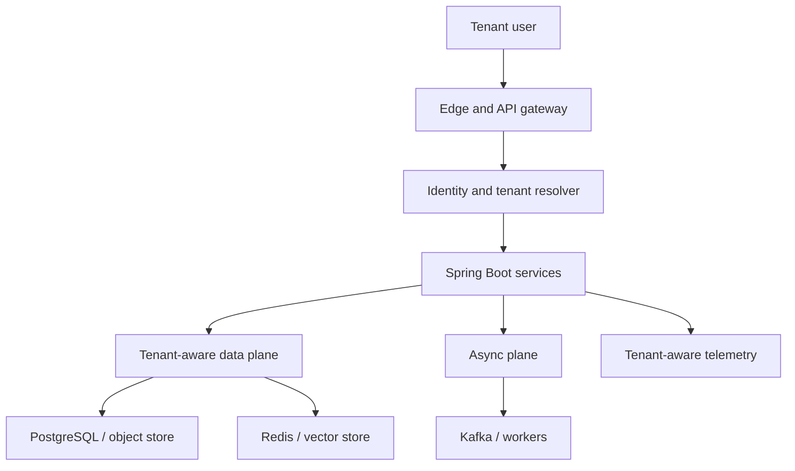
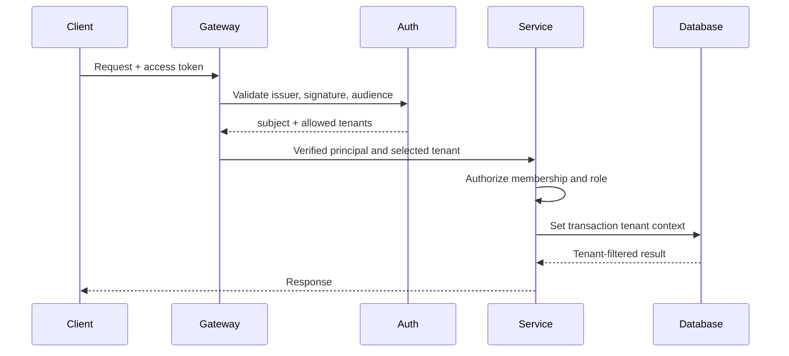
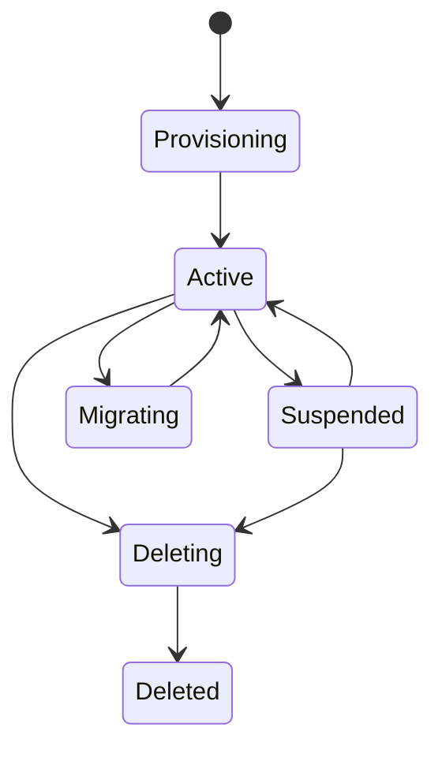
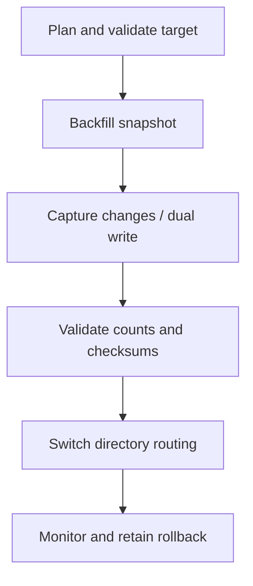

# Multi-Tenant System Design: Zero to Production

> A senior-level guide to designing, securing, scaling and operating SaaS platforms in which many customers share infrastructure without sharing data, capacity or trust.

## 1. What multi-tenancy really means

A **tenant** is a customer, organization or business boundary whose users, data, configuration, quotas, encryption material, billing and operational visibility must be isolated from other tenants.

Multi-tenancy is not achieved by adding a `tenant_id` column. It is an end-to-end invariant:

> Every request, query, cache entry, event, job, log, metric, file, model call and administrative action must carry a verified tenant context and enforce the corresponding policy.

The design must balance:

- isolation and cost efficiency;
- customization and platform consistency;
- regional/compliance requirements and operational simplicity;
- tenant growth and noisy-neighbour protection;
- shared upgrades and tenant-specific migration windows.

### Worked domain

This chapter uses a SaaS Online Interview Platform:

- a **tenant** is a hiring organization;
- tenant users are recruiters, interviewers and administrators;
- candidates may be invited into a tenant-scoped interview;
- questions, interviews, answers, scores, documents and AI usage belong to one tenant;
- platform operators may support tenants but must not receive unrestricted data access.

## 2. Start with the tenancy contract

Before technology selection, record:

| Decision | Questions |
|---|---|
| Tenant boundary | Organization, subsidiary, workspace, project or legal entity? |
| Identity | Can one human belong to multiple tenants? Can a candidate be external? |
| Isolation tier | Logical, schema, database, cluster, account or region? |
| Customization | Branding, workflows, retention, model provider, keys, schema? |
| Scale | Tenant count, largest tenant, skew, burst patterns and growth? |
| Compliance | Residency, retention, legal hold, audit and deletion? |
| Availability | Shared SLO or premium per-tenant SLO? |
| Lifecycle | Trial, activate, suspend, export, migrate and delete? |
| Economics | Cost attribution, quotas, billing and premium isolation? |

Define non-negotiable invariants, for example:

1. A tenant user can never read or mutate another tenant's interview data.
2. A platform administrator needs explicit, time-bound, audited elevation.
3. Events and background jobs retain the originating tenant.
4. Tenant deletion is complete, verifiable and recoverable only during the agreed grace period.
5. A single tenant cannot exhaust the platform's global capacity.

## 3. Reference architecture



The control plane manages tenants, plans, policies, placement, keys and lifecycle. The data plane serves interviews, documents, RAG, scoring and events. Separating them reduces the chance that ordinary application paths acquire unrestricted platform privileges.

## 4. Tenant identification and trusted context propagation

Tenant identity may originate from:

- an authenticated token claim such as `tenant_id`;
- a tenant-specific hostname;
- an invitation mapped to a tenant;
- an internal job/event envelope;
- a control-plane lookup for multi-tenant users.

Never trust a client-supplied `X-Tenant-Id` by itself. Resolve it against the authenticated principal and membership store. If URL or host tenant and token tenant disagree, reject the request.

A safe flow is:



In Spring Boot, use a request-scoped immutable context, not a mutable global or `ThreadLocal` that leaks across asynchronous/virtual-thread boundaries.

```java
public record TenantContext(UUID tenantId, String subject, Set<String> roles) {}

@Component
final class TenantContextResolver {
    TenantContext resolve(Jwt jwt, UUID requestedTenant) {
        Set<UUID> memberships = claimTenantIds(jwt);
        if (!memberships.contains(requestedTenant)) {
            throw new AccessDeniedException("Tenant membership required");
        }
        return new TenantContext(requestedTenant, jwt.getSubject(), claimRoles(jwt));
    }
}
```

Propagate tenant context explicitly through service commands and event envelopes. Do not make domain services silently obtain it from HTTP state.

## 5. Data-isolation models

| Model | Isolation | Cost/operations | Best fit | Main risk |
|---|---:|---:|---|---|
| Shared DB, shared schema | Logical | Lowest | Many small tenants | Missing predicate/data leak |
| Shared DB, schema per tenant | Stronger namespace | Medium/high | Tens or hundreds of tenants | Migration/schema explosion |
| Database per tenant | Strong | High | Premium/regulatory tenants | Fleet and connection overhead |
| Cluster/account per tenant | Strongest | Highest | Strict isolation/residency | Cost and upgrade complexity |
| Hybrid/pooled + silo | Tiered | Medium | Mixed SaaS portfolio | Placement/routing complexity |

### Shared schema

Every tenant-owned table includes a non-null `tenant_id`. Primary and unique constraints must include it.

```sql
CREATE TABLE interview (
    tenant_id UUID NOT NULL,
    interview_id UUID NOT NULL,
    title TEXT NOT NULL,
    external_reference TEXT,
    PRIMARY KEY (tenant_id, interview_id),
    UNIQUE (tenant_id, external_reference)
);

CREATE INDEX ix_interview_tenant_created
    ON interview (tenant_id, created_at DESC);
```

A global unique constraint on `external_reference` would incorrectly couple tenants. Foreign keys should also carry tenant identity, preventing a child row from referencing another tenant's parent.

### PostgreSQL row-level security

Application predicates are useful but insufficient as the only protection. Add defence in depth:

```sql
ALTER TABLE interview ENABLE ROW LEVEL SECURITY;
ALTER TABLE interview FORCE ROW LEVEL SECURITY;

CREATE POLICY tenant_isolation ON interview
USING (tenant_id = current_setting('app.tenant_id', true)::uuid)
WITH CHECK (tenant_id = current_setting('app.tenant_id', true)::uuid);
```

At the start of every transaction:

```sql
SELECT set_config('app.tenant_id', :tenant_id, true);
```

Use transaction-local configuration, reset pooled connections, and ensure the application role cannot bypass RLS. Migration/administrative roles must be separate and tightly controlled. Test missing context, wrong context and connection reuse.

### Hybrid placement

Maintain a control-plane directory:

```text
tenant_id -> isolation_tier -> region -> shard/database -> schema -> key_id -> status
```

Normal services ask a routing component for placement. Premium tenants can move from a pool to a dedicated database without changing public APIs.

## 6. Keycloak identity design

Common choices:

| Choice | Advantages | Problems |
|---|---|---|
| Realm per tenant | Strong identity isolation and customization | Operational explosion, upgrades and cross-tenant users |
| Shared realm + organizations/groups | Scales operationally; one identity can join many tenants | Authorization must rigorously verify membership |
| Dedicated realm for regulated tier | Strong tiering | Hybrid routing and federation complexity |

For large SaaS platforms, prefer a shared workforce/customer realm with organization membership unless contractual isolation demands a realm per tenant. Tokens should contain stable IDs, not mutable tenant names. Keep access tokens small; obtain detailed entitlements from a policy service when needed.

Validate issuer, signature, audience, expiry and authorized party. Tenant membership and resource authorization remain server-side responsibilities; a token claim is context, not automatic permission.

## 7. Tenant-aware APIs and service boundaries

- Put tenant scope in the resource hierarchy when it improves clarity: `/tenants/{tenantId}/interviews/{id}`.
- Validate path tenant against identity membership.
- Use opaque resource IDs, but never depend on opacity for authorization.
- Scope idempotency keys: `tenantId + operation + clientKey`.
- Return `404` or `403` consistently according to the information-disclosure policy.
- Require tenant context in repository interfaces.
- Prevent cross-tenant joins except through an approved analytics pipeline.
- Protect bulk exports and search endpoints with the same filters as point reads.

```java
interface InterviewRepository {
    Optional<Interview> findByTenantIdAndInterviewId(UUID tenantId, UUID interviewId);
}
```

Avoid `findById(id)` for tenant-owned aggregates. Static analysis or architecture tests can forbid unsafe repository methods.

## 8. Caches, sessions, vector stores and files

A cache key must include tenant and relevant authorization/version context:

```text
tenant:{tenantId}:interview:{interviewId}:v{version}
```

Also isolate:

- Redis rate-limit buckets and distributed locks;
- semantic caches and embedding namespaces;
- vector-store collections/metadata filters;
- object-store prefixes or buckets;
- CDN keys and signed URLs;
- local temporary files;
- model prompt caches.

Do not rely only on a vector metadata filter supplied by the caller. Construct mandatory filters server-side and test that the vector database cannot return another tenant's chunks.

For sensitive or premium tiers, use dedicated Redis databases/clusters, vector indexes or object-store buckets. Encryption boundaries should follow the isolation promise.

## 9. Kafka, events and background jobs

Every event envelope should include a verified tenant ID:

```json
{
  "eventId": "uuid",
  "eventType": "INTERVIEW_SUBMITTED",
  "tenantId": "uuid",
  "occurredAt": "2026-08-03T10:00:00Z",
  "schemaVersion": 2,
  "correlationId": "uuid",
  "payload": {}
}
```

Design rules:

- derive tenant ID from the committed aggregate/outbox, not producer input;
- partition by `tenantId + aggregateId` where per-aggregate ordering matters;
- enforce tenant authorization again in consumers;
- include tenant scope in deduplication keys;
- preserve context across retries and dead-letter records;
- avoid topic-per-tenant for thousands of small tenants;
- reserve dedicated topics/clusters for regulatory or very high-volume tiers;
- make replay tooling tenant-aware and auditable.

Schedulers must enumerate work by placement and tenant, establish context per unit, then clear it. Never run a global query and assume downstream code will filter correctly.

## 10. Noisy-neighbour prevention, quotas and billing

Control contention at multiple layers:

| Layer | Control |
|---|---|
| Edge | Per-tenant request/token rate limits |
| Service | Bulkheads, concurrency caps and admission control |
| Database | Statement timeout, pool budgets and workload classes |
| Kafka | Producer quotas, partition strategy and consumer fairness |
| AI | Token budgets, model allowlists and bounded concurrency |
| Storage | Quotas, lifecycle policies and upload limits |
| Jobs | Fair queues, tenant weights and maximum runtime |

Use hierarchical limits: global safety limit, plan limit, tenant override and endpoint/model-specific limit. Return `429` with retry guidance for temporary exhaustion and a distinct business error when a contractual quota is exhausted.

Record billable usage through an idempotent ledger, not transient metrics:

```text
usage_event_id, tenant_id, feature, quantity, unit, price_version, occurred_at
```

Reconcile the ledger against provider invoices and platform telemetry.

## 11. Encryption, secrets and key isolation

Use TLS in transit and encryption at rest. For stronger tenant isolation:

- envelope-encrypt data with a tenant-specific data-encryption key;
- wrap keys with KMS/HSM-managed key-encryption keys;
- store only key identifiers with records;
- separate application, support and key-administration privileges;
- audit decrypt operations;
- support rotation without rewriting all data immediately;
- prohibit tenant-provided API keys from logs and traces.

For AI providers, allow bring-your-own-key only through a secret manager. Resolve the key at execution, restrict egress, redact prompts, and record provider/model/policy—not the secret.

## 12. Residency, retention, deletion and audit

Tenant placement must enforce region before data is written. Consider primary data, replicas, backups, logs, search indexes, vectors, object stores, analytics, support tooling and external AI providers.

Lifecycle controls:

1. define tenant-specific retention policy;
2. apply legal holds before deletion;
3. tombstone and stop new processing;
4. delete transactional, cached, vector, object and derived data;
5. expire backups according to documented policy;
6. produce a deletion certificate/evidence;
7. preserve only legally required, minimized audit records.

Audit records include actor, tenant, action, target, result, reason, correlation ID, source and timestamp. Make them append-only and access-controlled. Platform support access requires ticket/reason, approval where required, expiration and prominent auditing.

## 13. Tenant onboarding, suspension and deletion

Model tenant lifecycle as a state machine:



Provisioning should be idempotent and resumable:

- create tenant identity and stable ID;
- choose region, tier and placement;
- create schema/database/bucket/index when required;
- create encryption keys and secret references;
- seed roles and policies;
- apply quotas and feature flags;
- run a synthetic isolation test;
- activate only after all checks pass.

Suspension must block writes and costly jobs while preserving the contracted read/export behavior. Deletion is an asynchronous, observable workflow with approvals, retries and evidence.

## 14. Observability, SLOs and cost attribution

Include `tenant_id` in structured logs and traces when permitted, but avoid using unbounded tenant IDs as labels on every Prometheus metric. High-cardinality per-tenant analysis belongs in logs, traces, exemplars or an analytics store.

Measure:

- latency, error and saturation by plan/tier;
- top resource-consuming tenants;
- database and Kafka skew;
- AI tokens, latency, quality and cost per tenant;
- throttling and quota exhaustion;
- authentication/authorization denials;
- cross-tenant access attempts;
- lifecycle workflow progress.

Provide tenant-facing usage and audit views from curated data, not unrestricted internal telemetry. Define premium tenant SLOs only if the architecture can isolate and measure them.

## 15. Scaling, sharding and tenant mobility

Tenant-based sharding gives simple routing and containment, but a very large tenant can outgrow one shard. Options include:

- shard small tenants by consistent hash;
- place large tenants explicitly;
- sub-shard a large tenant by aggregate or time;
- use read replicas for read-heavy workloads;
- separate operational and analytical data paths.

### Online tenant move



A robust move procedure:

1. make placement metadata versioned;
2. provision and migrate schema on target;
3. copy a consistent snapshot;
4. capture changes with CDC or an outbox;
5. validate row counts, checksums and invariants;
6. briefly quiesce or use version-fenced dual writes;
7. atomically switch the tenant directory;
8. invalidate caches and drain old workers;
9. monitor tenant-specific SLOs;
10. retain a rollback window, then securely retire the source.

Never let two routing versions accept conflicting writes. Every request/job should carry or resolve a placement version.

## 16. Cross-tenant leak prevention and testing

This is the highest-priority risk. Build an automated isolation suite:

- create Tenant A and Tenant B with similar IDs and names;
- attempt reads, writes, searches, exports and deletes across tenants;
- mutate path/header/token combinations;
- verify RLS with missing and wrong transaction context;
- reuse pooled connections between tenants;
- test caches, vectors, files and signed URLs;
- replay Kafka events with altered tenant IDs;
- test jobs, DLQs, retries and admin endpoints;
- fuzz object IDs and filters;
- verify logs, traces and error messages do not disclose data;
- run concurrency tests during tenant migration;
- test support impersonation approval and expiry.

Property-based tests can assert that every returned record's tenant equals the authorized tenant. Add these tests to release gates, not only annual penetration testing.

## 17. SaaS reference design for the interview platform

Recommended starting point:

- shared Keycloak realm with organization membership;
- shared PostgreSQL schema with composite tenant keys and RLS;
- shared Kafka topics with tenant-aware envelopes;
- shared Redis and pgvector with mandatory tenant namespaces;
- per-tenant quotas for API, storage and AI tokens;
- tenant-specific object prefixes and optional KMS keys;
- control-plane placement directory;
- dedicated database/vector index/key for premium regulated tenants;
- Kubernetes namespace/workload separation only where the tier justifies it.

The Spring Boot orchestrator owns tenant membership, interviews, assignments and authorization. The Python AI service receives a signed internal context, never a raw client-selected tenant, and applies tenant filters to retrieval and evaluation datasets. AI prompts and traces follow retention and residency policy.

## 18. Decision framework and practical exercises

### Architecture review matrix

Score each proposed design from 1 (weak) to 5 (strong):

| Dimension | Evidence required |
|---|---|
| Data isolation | DB policies, composite keys and adversarial tests |
| Identity isolation | Membership model, token validation and admin controls |
| Compute fairness | Rate limits, bulkheads, queues and load evidence |
| Async correctness | Tenant envelopes, idempotency, DLQ/replay controls |
| Lifecycle | Automated onboarding, suspension, export and deletion |
| Compliance | Residency map, retention, audit and key strategy |
| Mobility | Shard placement and tested tenant-move runbook |
| Operability | Tenant-aware diagnosis without metric explosion |
| Economics | Usage ledger, attribution and tier model |
| Evolution | Backward-compatible APIs/events and migration plan |

### Hands-on labs

1. **Shared-schema lab:** add composite tenant keys and PostgreSQL RLS; prove wrong-tenant and missing-context access fail.
2. **Spring Security lab:** resolve membership from JWT and reject mismatched path/header tenant context.
3. **Cache/vector lab:** reproduce and fix a cross-tenant cache-key and retrieval-filter defect.
4. **Kafka lab:** publish outbox events, consume idempotently and safely replay only one tenant.
5. **Noisy-neighbour lab:** generate one abusive tenant and demonstrate fair limits and healthy SLOs for another.
6. **Lifecycle lab:** build an idempotent onboarding and deletion workflow with audit evidence.
7. **Mobility lab:** move a tenant between PostgreSQL databases using snapshot + CDC/outbox and validate checksums.
8. **Security lab:** run an isolation test matrix across REST, database, Redis, Kafka, files and AI retrieval.
9. **Architecture lab:** write ADRs selecting pooled, silo or hybrid tenancy for three customer tiers.
10. **Operations lab:** diagnose a single-tenant latency incident from traces, logs and usage data.

### Production readiness checklist

- [ ] Tenant boundary and lifecycle are explicit.
- [ ] Tenant context comes from verified identity/membership.
- [ ] All owned data has enforced tenant scope.
- [ ] Database constraints and RLS provide defence in depth.
- [ ] Cache, vector, file, event and job paths are tenant-aware.
- [ ] Per-tenant quotas, bulkheads and usage ledger exist.
- [ ] Keys, residency, retention and audit meet contracts.
- [ ] Support access is time-bound and audited.
- [ ] Onboarding, suspension, export, migration and deletion are tested.
- [ ] Cross-tenant adversarial tests block releases.
- [ ] Tenant-specific incidents and costs can be diagnosed.
- [ ] Large tenants can be moved without unsafe writes.

## Architect interview prompts

1. When would you reject schema-per-tenant even though it appears safer?
2. How do you prevent a missing `WHERE tenant_id = ?` from becoming a breach?
3. How would you support a user belonging to ten organizations in Keycloak?
4. Why can a shared Redis or vector store violate an otherwise sound design?
5. When does topic-per-tenant become operationally harmful?
6. How do you move one tenant to a dedicated database without downtime?
7. How do you prove deletion when immutable backups exist?
8. Which telemetry supports per-tenant diagnosis without cardinality collapse?
9. How do you price and enforce AI-token consumption fairly?
10. What evidence would convince you that tenant isolation is production-ready?

## Final principle

A mature multi-tenant design makes the safe path automatic and the unsafe path difficult. Tenant isolation must be centralized where possible, reinforced at every storage and execution boundary, tested adversarially, observable in production and evolvable as individual tenants grow from a few users to dedicated infrastructure.
