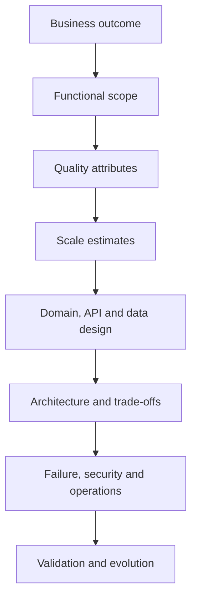
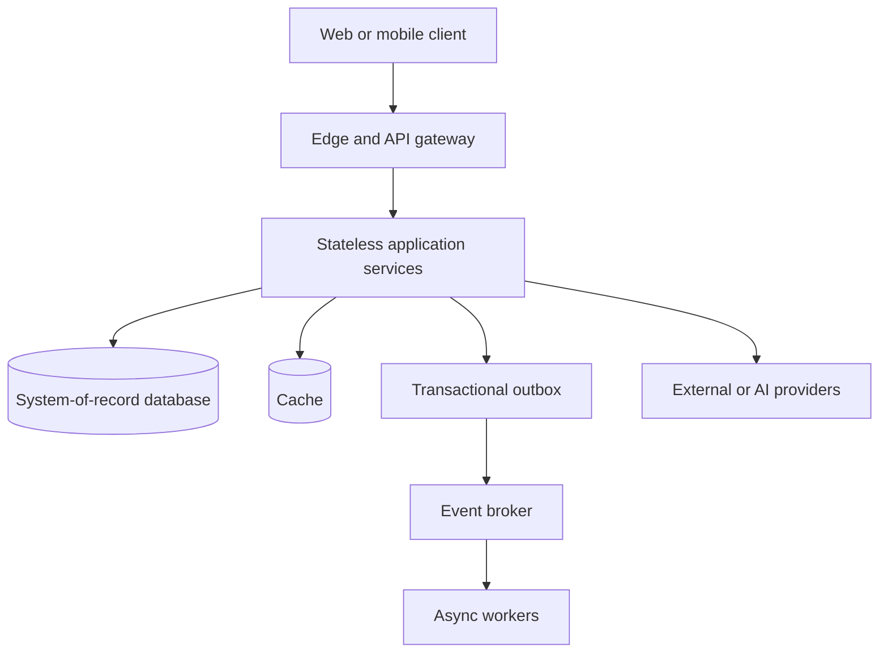
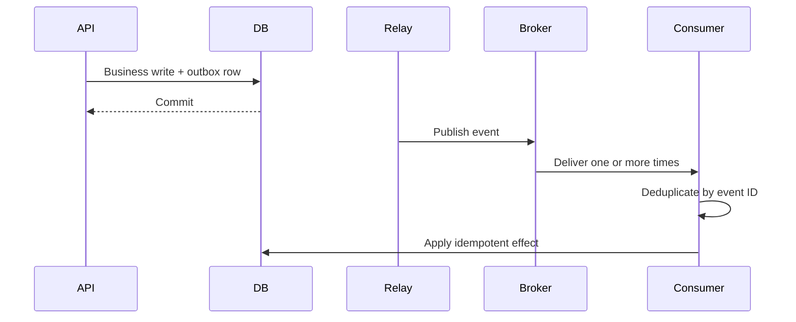
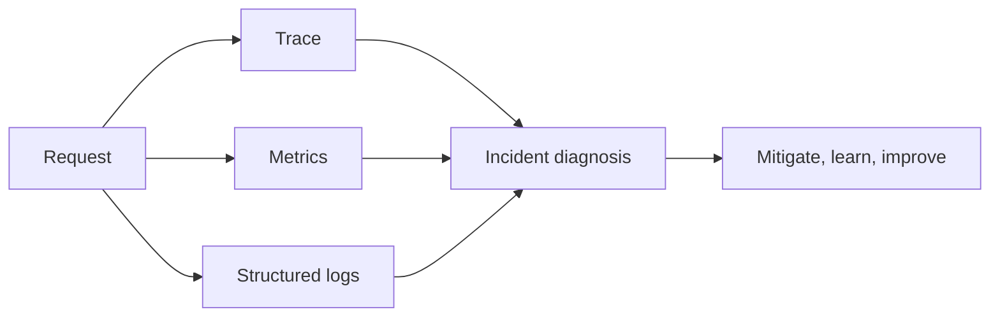

# System Design Fundamentals for an 18-Year Engineer

> **Audience:** experienced Java/Python engineers, technical leads and architects.  
> **Goal:** develop a repeatable way to design systems, defend trade-offs and evolve architecture safely—not collect fashionable components.

## 1. What senior system design really means

A senior designer does not begin with Kafka, Kubernetes or microservices. The work begins by reducing uncertainty:

1. Identify the business outcome and critical user journeys.
2. Make scale, security, compliance, availability and latency measurable.
3. Expose assumptions and unknowns.
4. Choose the simplest architecture that satisfies today's constraints.
5. Describe failure behaviour, operability and evolution—not only the happy path.
6. Record why major choices were made and what would cause them to change.

At 18 years of experience, interviewers and stakeholders expect judgment. Naming a pattern earns little credit unless you explain the problem it solves, its cost, its failure modes and the evidence that justifies it.

## 2. The end-to-end design method



Use this order in design workshops and interviews. Iteration is normal, but skipping directly to the architecture usually hides incorrect assumptions.

### Step 1 — Frame the problem

Write a one-sentence outcome:

> Allow authenticated candidates to complete a scheduled online interview and receive a trustworthy result while interviewers manage questions and reviews.

Then define:

- Actors and their permissions
- Three to five critical user journeys
- In-scope and explicitly out-of-scope behaviour
- Existing systems, deadlines, team skills and regulatory constraints
- Success metrics such as completion rate, time to result or cost per interview

Ask questions that change architecture: Is submission allowed during a network interruption? Is strict ordering required? May results be temporarily stale? Which data is legally sensitive? What is the expected growth? What happens when the model provider is unavailable?

### Step 2 — Convert NFRs into quality-attribute scenarios

“Fast,” “secure” and “highly available” are not requirements. Use measurable scenarios.

| Attribute | Weak statement | Testable scenario |
|---|---|---|
| Latency | APIs must be fast | Submit-answer API p95 < 250 ms and p99 < 600 ms at 2,000 RPS |
| Availability | Highly available | Candidate write path provides 99.95% monthly availability |
| Durability | Never lose answers | An acknowledged answer survives loss of any single application node |
| Recovery | Recover quickly | RTO 30 minutes and RPO 5 minutes for regional database failure |
| Security | Secure access | Every resource is tenant- and owner-authorized; failed access is audited |
| Scalability | Must scale | Support 10x traffic without redesigning the domain model |
| Cost | Cost effective | Keep model and infrastructure cost below the agreed cost per completed interview |

Resolve conflicts explicitly. Strong consistency can increase latency; active-active recovery increases cost; aggressive caching can weaken freshness.

### Step 3 — Estimate before choosing components

Estimates need not be perfect. Their job is to eliminate impossible designs and identify bottlenecks.

Core formulas:

```text
average RPS = requests per day / 86,400
peak RPS = average RPS × peak factor
write bandwidth = writes/second × average record bytes
storage/year = records/day × record bytes × 365 × replication factor
concurrency ≈ arrival rate × average time in system
availability budget/month = (1 - target availability) × minutes/month
```

Example assumptions:

- 100,000 interviews/day
- 40 answer writes/interview
- 10× peak factor
- 2 KB average persisted answer event
- Three replicas for durable event storage

This yields roughly 46 average writes/s, 463 peak writes/s, 8 GB raw writes/day and about 8.8 TB/year at three copies before indexes, logs, backups and compression. State assumptions and provide a sensitivity range.

### Step 4 — Model the domain, APIs and ownership

Define domain invariants before service boundaries:

- An assignment belongs to one tenant and one candidate.
- A candidate may submit only within the allowed window.
- A submitted session is immutable except through an audited review workflow.
- A result version is calculated from a known question and answer-key version.

Design APIs around resources and use cases. Specify idempotency, pagination, concurrency control, error contracts and versioning.

```http
PUT /v1/sessions/{sessionId}/answers/{questionId}
Idempotency-Key: 94f...
If-Match: "answer-version-7"
Authorization: Bearer <token>
```

A repeat of the same idempotency key must return the same logical result. A stale `If-Match` should fail with a conflict rather than silently overwrite a newer answer.

Data ownership rules:

- One service is authoritative for each mutable business entity.
- Other services consume events or query through an owned contract.
- Shared databases are an explicit exception, not a shortcut.
- Cross-service workflows state their consistency and compensation policy.

### Step 5 — Draw the minimum useful architecture



Every arrow needs a contract, timeout, security boundary, observability and failure policy. Every stateful box needs ownership, capacity, backup and recovery decisions.

## 3. Architecture styles and boundaries

### Start with a modular monolith when it fits

A well-modularized monolith is often the best first production architecture: one deployment and transaction boundary, simpler debugging and lower operational cost. Enforce module boundaries in code and extract a service only when there is evidence.

Extract when independent scaling, release cadence, availability isolation, security boundaries or team ownership justify the network and consistency costs. “Microservices are modern” is not evidence.

| Style | Strength | Cost | Suitable trigger |
|---|---|---|---|
| Modular monolith | Simple transactions and operations | Coupled deployment | New domain, moderate team/scale |
| Microservices | Independent ownership and scaling | Network, data and operational complexity | Clear boundaries and independent change |
| Event-driven | Temporal decoupling and replay | Eventual consistency and diagnosis complexity | Async workflows, integration, audit |
| Serverless | Elasticity and low idle operations | Runtime limits, cold starts, lock-in | Bursty stateless/event workloads |
| Data/stream pipeline | High-volume transformations | Schema, replay and state complexity | Analytics, CDC, real-time aggregation |

Use domain language and business capability to find boundaries. Avoid splitting by technical layer (`user-controller-service`, `user-database-service`) or creating nanoservices.

## 4. Data-system fundamentals

### Choose a store from access patterns

Ask:

- What are the authoritative entities and invariants?
- What are the read and write shapes?
- Are joins, constraints or multi-row transactions required?
- What freshness, latency and durability are required?
- What is the growth and retention model?
- How will backup, restore, migration and deletion work?

| Need | Typical starting choice |
|---|---|
| Transactions, constraints and relational queries | Relational database |
| Flexible aggregate documents | Document database |
| Very low-latency ephemeral lookup | Key-value cache |
| Full-text relevance | Search engine |
| High-volume event retention/replay | Distributed log |
| Semantic similarity | Vector index, usually beside authoritative data |

Polyglot persistence has a permanent operations cost. Add a database only when it owns a distinct access pattern that the current store cannot meet responsibly.

### Consistency and transactions

Decide per invariant, not per system slogan:

- Strong consistency for uniqueness, money, authorization and irreversible state transitions.
- Eventual consistency for projections, search indexes, notifications and analytics when lag is acceptable.
- Optimistic concurrency for low-contention edits.
- Pessimistic locking only when contention and invariant risk justify blocking.
- Transactional outbox when database state and an emitted event must agree.
- Saga with explicit compensations for multi-service workflows; compensation is business logic, not database rollback.

CAP applies during a network partition: a distributed system must choose whether a particular operation favors consistency or availability. The answer can differ by operation.

### Partitioning, replication and sharding

- Replication improves read scale and availability but introduces lag, failover and consistency decisions.
- Partitioning improves manageability and query pruning when the partition key matches access patterns.
- Sharding distributes ownership and write capacity but makes cross-shard queries, rebalancing and transactions harder.

Do not shard because the system “may become large.” Measure the primary database ceiling, exhaust indexing/query/schema improvements and choose a shard key only from demonstrated access patterns.

## 5. Communication and distributed systems

### Synchronous calls

Use when the caller needs an immediate answer. Define:

- Connect and response timeouts
- Bounded retries only for transient, idempotent operations
- Exponential backoff with jitter
- Circuit breaking and concurrency limits
- Deadline propagation
- Stable error taxonomy

Retries amplify load during an outage. If three layers each retry three times, one user request can become 27 downstream attempts. Set a single retry owner and a total deadline.

### Asynchronous messaging

Use for buffering, fan-out, long-running work, integration and temporal decoupling. Define:

- Event key and ordering scope
- Schema compatibility and ownership
- At-least-once delivery and consumer idempotency
- Retry topic or delayed retry policy
- Dead-letter handling and replay procedure
- Lag, age and poison-message alerts

“Exactly once” is never a substitute for end-to-end business idempotency. A consumer can write successfully and crash before acknowledging.

### Delivery semantics pattern



## 6. Scaling and performance

Scale only after locating the limiting resource: CPU, memory, disk IOPS, network, connection pool, lock contention, downstream quota or a serial critical section.

### Practical scaling order

1. Measure with traces, profiles and query plans.
2. Remove unnecessary work and fix complexity.
3. Optimize data access and indexes.
4. Cache stable, frequently read data.
5. Add controlled concurrency and batching.
6. Scale stateless compute horizontally.
7. Partition workload or data only when simpler approaches reach a measured limit.

### Caching questions

For every cache define:

- Key and tenant boundary
- Source of truth
- TTL and acceptable staleness
- Invalidation/update mechanism
- Maximum size and eviction policy
- Stampede protection
- Behaviour when the cache is unavailable
- Prevention of cache penetration and hot keys

Common patterns include cache-aside, read-through, write-through and write-behind. Cache-aside is a sensible default but can return stale data and create miss storms.

### Backpressure

Protect the whole dependency chain with bounded queues, connection pools and concurrency. Reject or defer excess work deliberately using `429`, `503`, broker buffering or admission control. An unbounded queue converts overload into an out-of-memory failure and extreme tail latency.

## 7. Reliability and resilience

Design from failure domains: process, node, zone, region, dependency, identity provider, broker, database, deployment and human operator.

| Mechanism | Protects against | Important warning |
|---|---|---|
| Timeout | Waiting forever | Must fit inside end-to-end deadline |
| Retry | Transient failure | Can multiply load and duplicate effects |
| Circuit breaker | Repeated calls to failing dependency | Does not replace capacity isolation |
| Bulkhead | Resource exhaustion spreading | Size pools from capacity evidence |
| Rate limit | Unfair or unsafe demand | Define tenant and endpoint dimensions |
| Load shedding | Collapse during overload | Preserve highest-value operations |
| Redundancy | Component loss | Correlated failures can defeat replicas |
| Graceful degradation | Optional dependency failure | Must be designed and tested beforehand |

Create a failure-mode table:

| Failure | Detection | Automatic response | User impact | Recovery evidence |
|---|---|---|---|---|
| Model provider timeout | Timeout/rate metrics | Circuit opens; fallback or queue | Degraded AI feature | Provider chaos test |
| Primary DB loss | Health and replication alerts | Promote replica | Brief write interruption | Restore/failover drill |
| Duplicate event | Dedup metric | Idempotent no-op | None | Replay test |
| Hot tenant | Per-tenant saturation | Quota and isolation | One tenant throttled | Load test |

Availability math matters. A serial path with independently available components has approximately the product of their availabilities. Three 99.9% serial dependencies yield about 99.7%, before correlated failures.

## 8. Security and privacy by design

Threat-model data flows and trust boundaries. Cover:

- Authentication and centrally enforced authorization
- Tenant isolation and object-level access control
- Least-privilege workload identity
- TLS in transit and encryption at rest
- Secret storage, rotation and revocation
- Input validation, output encoding and file controls
- Audit trails for sensitive changes
- Data classification, minimization, retention and deletion
- Dependency, container and infrastructure scanning
- Abuse prevention, quotas and anomaly detection
- Supply-chain provenance and signed artifacts

For AI systems, treat prompts, retrieved content, model output and tool arguments as untrusted. Enforce authorization again at retrieval and tool-execution time. Never let model text become authority.

## 9. Observability and operability

Instrument for questions operators must answer:

- Is the service meeting user-facing SLOs?
- Which tenant, endpoint or dependency is affected?
- What changed?
- Is the problem traffic, code, data or infrastructure?
- Can we mitigate without making it worse?

Use RED for services (rate, errors, duration) and USE for resources (utilization, saturation, errors). Correlate logs, metrics and traces with request/trace IDs, while excluding tokens, credentials and sensitive business data.

Define service-level indicators and objectives. Alert on symptoms and error-budget burn, not every low-level fluctuation. Maintain dashboards, runbooks, ownership, rollback procedures and tested backups.



## 10. Deployment and evolutionary architecture

Prefer small, reversible changes:

- Backward-compatible APIs and events
- Expand-and-contract database migrations
- Feature flags with owners and expiry dates
- Canary or progressive delivery
- Automated health and business-metric verification
- Fast rollback or roll-forward
- Architecture fitness functions in CI

Examples of fitness functions:

- Modules cannot bypass ownership boundaries.
- APIs and events pass compatibility checks.
- Critical paths meet latency and error budgets.
- Containers contain no critical vulnerabilities.
- Tenant-isolation tests pass.
- Restore and replay procedures meet RTO/RPO.

Architecture is not a one-time diagram. Review decisions when load, regulation, organization, cost or failure evidence changes.

## 11. Cost and sustainability

Estimate cost per business unit: per interview, request, tenant or generated answer. Include compute, database, storage, transfer, observability, support, licenses and model tokens.

Avoid false economy. Removing redundancy may reduce infrastructure cost but increase expected outage loss. Conversely, multi-region active-active is wasteful when the business can tolerate a 30-minute recovery.

Use workload scheduling, right-sizing, retention tiers, caching, batching, model routing and quotas. Assign owners to cost anomalies just as you assign owners to reliability incidents.

## 12. Senior decision records

Record important choices with an ADR:

```markdown
# ADR: Use transactional outbox for result events

## Context
Result state and emitted events must not diverge.

## Decision
Commit the result and an outbox record in one PostgreSQL transaction.

## Alternatives
Direct broker publish; distributed transaction; scheduled database polling.

## Consequences
At-least-once publication, consumer idempotency, relay lag and replay operations.

## Evidence and revisit trigger
Load/failure tests; revisit if relay lag violates the result SLO.
```

An ADR is valuable because it preserves reasoning, not because it certifies a technology choice.

## 13. How to lead a design review

Use this agenda:

1. Business outcome and scope
2. Assumptions and unresolved questions
3. Quality attributes and estimates
4. Domain, APIs and data ownership
5. Key request and event flows
6. Failure modes, security and operations
7. Alternatives and trade-offs
8. Validation plan and incremental delivery
9. Decisions, owners and revisit triggers

Challenge the design, not the author. Ask “What evidence supports this capacity?” and “What happens after this write succeeds but publishing fails?” Avoid status-driven architecture and premature consensus.

## 14. System-design interview framework

For a 45–60 minute interview:

| Time | Activity |
|---:|---|
| 0–5 min | Clarify users, core journeys, scope and constraints |
| 5–10 min | Quantify scale and quality attributes |
| 10–18 min | Define APIs, data model and invariants |
| 18–30 min | Draw high-level architecture and primary flow |
| 30–42 min | Deep dive into one or two critical risks |
| 42–52 min | Cover failures, security, observability and cost |
| 52–60 min | Summarize trade-offs, evolution and open questions |

Narrate decisions. If you choose Kafka, say why synchronous calls are insufficient, what ordering is required, how duplicates are handled and how lag is operated.

### Signals expected from an architect

- Separates requirements from solutions
- Quantifies instead of using vague adjectives
- Protects invariants and data ownership
- Treats failure as a normal operating condition
- Understands organizational and migration constraints
- Offers alternatives and explicit trade-offs
- Plans validation, delivery and rollback
- Communicates clearly at multiple levels

## 15. Worked mini-case: online interview submission

### Requirements

- Candidate answers autosave and final submission must be idempotent.
- An acknowledged answer must not be lost.
- Submission p95 is below 500 ms at expected peak.
- AI grading may take minutes and may be unavailable.
- Candidate cannot access another candidate's session.

### Design

1. Authenticate with OIDC; authorize tenant, assignment and candidate ownership in the application.
2. Use an idempotent answer-upsert API with optimistic versioning.
3. Persist answers and final session transition in PostgreSQL.
4. Write `INTERVIEW_SUBMITTED` to a transactional outbox in the same transaction.
5. Relay to Kafka; an idempotent grading consumer invokes the AI service.
6. Store versioned grading results and evidence; notify asynchronously.
7. Expose processing status instead of holding the submission request open.

### Trade-offs

- Async grading improves submission reliability and isolates the model provider, but results are eventually consistent.
- PostgreSQL protects session invariants; Kafka enables buffering and replay but requires schema governance and consumer idempotency.
- Cached reads improve dashboard latency, but authorization is evaluated against authoritative claims and ownership.

### Failure tests

- Kill the API after database commit but before event publication.
- Deliver the same submission event five times.
- Time out the model provider for 15 minutes.
- Revoke candidate access during an active session.
- Fail over the primary database and measure RTO/RPO.

## 16. Hands-on curriculum for you

Build evidence in six iterations:

### Lab 1 — Requirements and estimates

Produce a one-page brief, quality-attribute table, traffic/storage estimates and explicit assumptions for `Java_AI_MCP`.

### Lab 2 — Domain and contracts

Create context boundaries, invariants, OpenAPI contracts, event schemas and a data-ownership matrix.

### Lab 3 — Reliability

Implement idempotency, outbox, bounded retries, circuit breaking, bulkheads and overload behaviour. Demonstrate duplicate delivery and provider outage.

### Lab 4 — Security

Create a threat model, authorization matrix, tenant-isolation tests, secret-rotation procedure and audit design.

### Lab 5 — Performance and operations

Run load tests, inspect query plans, define SLOs, build dashboards and practise backup restore plus incident diagnosis.

### Lab 6 — Evolution

Perform a backward-compatible schema/API change, canary release and rollback. Write ADRs for the three most important decisions.

Each lab should produce code or measurable evidence, not only prose.

## 17. Common senior-level mistakes

- Starting with a vendor or architecture style
- Treating every non-functional requirement as “high”
- Assuming horizontal scaling fixes a database or serialization bottleneck
- Using retries without deadlines, idempotency or retry budgets
- Adding caches without invalidation and failure semantics
- Saying “eventual consistency” without defining acceptable lag
- Splitting services without clear ownership
- Ignoring deployment, migration, rollback and operational staffing
- Drawing only the happy path
- Claiming exactly-once behaviour without an end-to-end invariant
- Overengineering for hypothetical scale while missing today's reliability needs
- Presenting one solution without alternatives or revisit triggers

## 18. Architect readiness checklist

You are ready to lead the design when you can answer “yes” to these:

- Can I state the business outcome and exclusions in one minute?
- Are latency, availability, durability, recovery and cost measurable?
- Are scale estimates and assumptions visible?
- Are domain invariants and data owners explicit?
- Do APIs and events define idempotency, versioning and errors?
- Can I explain the consistency model per critical operation?
- Are overload, dependency failure and partial-success paths designed?
- Is authorization enforced at every resource and tenant boundary?
- Are SLOs, dashboards, runbooks, backup and restore included?
- Can the system be deployed, migrated and rolled back safely?
- Did I compare credible alternatives and record consequences?
- Is there a test or experiment for every major architecture claim?

## 19. Practice questions

Design and defend:

1. An online interview platform supporting 100,000 interviews/day
2. A payment service with idempotent transfers and an immutable ledger
3. A notification platform with preferences, retries and provider failover
4. A URL shortener with abuse controls and global reads
5. A rate limiter for multiple tenants and plans
6. A Kafka order pipeline with replay and poison messages
7. A permission-aware enterprise RAG system
8. A multi-region policy administration system with strict audit requirements

For each, produce requirements, estimates, APIs, data model, diagrams, failure table, security model, SLOs, cost considerations, ADRs and a staged delivery plan.

## Final principle

Your 18 years are an advantage when you use them to recognize constraints, operational risk and organizational reality. The migration from experienced developer to strong system designer is not about naming more technology. It is about making important decisions explicit, measurable, reversible where possible and defensible with evidence.

