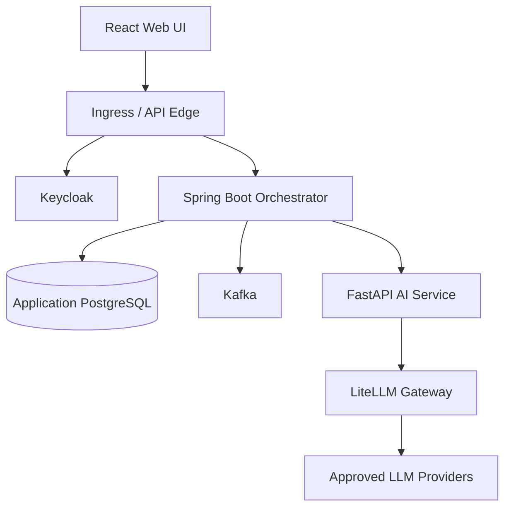
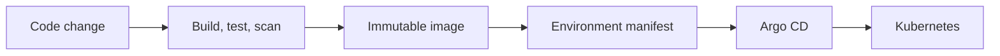

# AI-Assisted Online Interview Platform

## 1. Executive summary

This platform enables interviewers to define and assign interviews, candidates to complete them securely, AI services to assist with question generation and evaluation, and reviewers to make the final hiring decision.

AI assists the workflow; it does not own authoritative interview state or make an unreviewable high-impact decision.

## 2. Scope

### In scope

- Candidate and interviewer authentication
- Interview definition, assignment, execution, submission, and review
- Multiple-choice and long-text questions
- AI-assisted question generation and answer evaluation
- Candidate score and pass/fail visibility according to publication policy
- Auditability, observability, and Kubernetes deployment

### Out of scope for the first release

- Live video interviewing and recording
- Fully autonomous hiring decisions
- Internet-scale proctoring
- Multi-region active-active writes

## 3. Quality attributes

| Attribute | Initial target | Notes |
|---|---:|---|
| API availability | 99.9% monthly | Excludes planned maintenance |
| Read API p95 latency | < 300 ms | Excludes AI inference |
| AI operation p95 latency | < 15 s | Async processing preferred |
| Submission durability | No acknowledged loss | PostgreSQL is authoritative |
| Recovery point objective | ≤ 5 minutes | Validate with restore tests |
| Recovery time objective | ≤ 60 minutes | Initial single-region target |
| Audit retention | Configurable | Align with legal/privacy policy |

Targets are hypotheses until validated by performance and recovery testing.

## 4. Core architecture

### Responsibilities

| Component | Responsibility |
|---|---|
| React UI | User experience; no authoritative business data or tokens in local storage |
| Keycloak | Authentication, OIDC sessions, roles, and token issuance |
| Orchestrator | Business rules, authorization, workflow state, APIs, and audit events |
| PostgreSQL | System of record for interviews, assignments, questions, answers, reviews, and results |
| Kafka | Durable asynchronous work and integration events—not the system of record |
| AI service | Prompting, retrieval/evaluation workflows, structured result validation |
| LiteLLM | Provider abstraction, policy, routing, budgets, telemetry, and failover |
| Kubernetes | Workload scheduling, configuration, health, scaling, and isolation |

Keycloak uses its own PostgreSQL database/schema lifecycle. Application services do not read Keycloak tables directly.

## 5. Trust boundaries and identity

1. The browser starts the OpenID Connect Authorization Code flow with PKCE.
2. Prefer a backend-for-frontend with secure, HttpOnly, SameSite cookies when browser token exposure must be minimized.
3. The API edge may reject obviously invalid tokens, but each resource server remains responsible for authorization.
4. The orchestrator validates issuer, audience, signature, expiry, and required claims using Keycloak JWKS.
5. Roles provide coarse access; resource ownership and assignment state provide fine-grained authorization.
6. Service identities use short-lived credentials and least privilege.
7. AI tools receive scoped capabilities, not end-user or platform-wide credentials.

Authorization examples:

- A candidate can access only their active assignment.
- An interviewer can manage interviews they own or are explicitly permitted to manage.
- A reviewer cannot alter a submitted answer; review data is separately recorded.
- AI output cannot directly publish a final result.

## 6. Data ownership

PostgreSQL is authoritative for:

- interview definitions and versions;
- assignment windows and attempt state;
- generated questions and their provenance;
- candidate answers and submission timestamps;
- review scores, feedback, overrides, and reviewer identity;
- result publication state;
- audit records or durable audit-event references.

The browser must not use local storage for business state, access tokens, or refresh tokens. Temporary UI state may remain in memory; server-side drafts protect against refresh or device failure.

Flyway migrations are versioned with the owning service and promoted through environments with backups, compatibility checks, and roll-forward plans.

## 7. Critical submission flow

1. Candidate loads the assignment; the server verifies identity, ownership, state, and time window.
2. Draft answers are saved through idempotent APIs.
3. Final submission includes an idempotency key and expected attempt version.
4. One database transaction:
   - locks or compare-and-sets the active attempt;
   - persists final answers;
   - marks the attempt submitted;
   - writes an outbox event.
5. A relay publishes the outbox event to Kafka.
6. Evaluation consumers process the event idempotently.
7. AI-generated scoring is stored with model, prompt/configuration version, evidence, latency, and cost metadata.
8. A human reviewer confirms or overrides the evaluation where policy requires.
9. Result publication is a separate authorized state transition.

This design prevents duplicate clicks or redelivery from creating multiple submissions.

## 8. AI safety and governance

- Send only the minimum candidate data required for the task.
- Remove secrets and unnecessary personal information from prompts.
- Use structured output schemas and reject invalid responses.
- Separate deterministic scoring rules from model judgment.
- Defend retrieval and tools against prompt injection.
- Apply tenant and user authorization before retrieval.
- Allow-list models, tools, destinations, and maximum budgets.
- Record model and configuration versions for reproducibility.
- Evaluate accuracy, bias, safety, latency, and cost on a versioned dataset.
- Require human review for hiring-impacting conclusions.
- Provide a non-AI or manual fallback when providers are unavailable.

## 9. Failure handling

| Failure | Expected behaviour |
|---|---|
| Duplicate submission | Same idempotency key returns the original outcome |
| Database unavailable | Do not acknowledge submission; preserve client retry path |
| Kafka unavailable | Commit submission and outbox atomically; publish later |
| AI provider timeout | Bounded retry, then alternate model or manual-review queue |
| Invalid AI response | Reject schema, record telemetry, retry safely or escalate |
| Keycloak unavailable | Existing valid sessions may work until validation/cache policy expires; new login fails safely |
| Consumer redelivery | Idempotent processing keyed by event and attempt |
| Partial result publication | Transactional state transition; reconcile notification separately |

Retries use exponential backoff with jitter and a maximum attempt/time budget. Poison messages move to a controlled failure workflow with alerts and replay tooling.

## 10. Observability

Correlate telemetry using trace ID, request ID, assignment ID, attempt ID, event ID, and AI operation ID. Avoid logging tokens, answer content, prompts containing personal data, or secrets.

Initial SLIs:

- successful authenticated API request ratio;
- submission success and end-to-end latency;
- outbox and consumer lag;
- evaluation completion latency;
- AI timeout, invalid-output, fallback, and manual-review rates;
- cost per generated question and evaluated attempt;
- login and authorization failure rates.

Use OpenTelemetry for traces/metrics/log correlation, Prometheus for metrics, Grafana for dashboards, and a controlled centralized log store.

## 11. Deployment and delivery

- GitHub Actions or Jenkins performs compilation, tests, SBOM generation, vulnerability scanning, and image publication.
- The pipeline updates a versioned deployment manifest.
- Argo CD reconciles the cluster from Git.
- Secrets come from an approved secret manager, not Git.
- Use readiness/startup/liveness probes with distinct purposes.
- Apply resource requests/limits, disruption budgets, network policies, and non-root containers.
- Promote the same immutable artifact across environments.
- Database migrations must be backward compatible during rolling deployment.

## 12. Architectural evolution

Begin with a well-structured Spring Boot business service plus a separately deployable AI service. Introduce more services only when boundaries require independent ownership, scaling, isolation, or release cadence.

Likely future boundaries:

- interview management;
- interview execution;
- evaluation and review;
- notifications;
- analytics.

Do not create these as microservices merely to match the list.

## 13. Validation plan

- Unit tests for state transitions and scoring rules
- API and event contract tests
- PostgreSQL integration and Flyway migration tests
- Keycloak role and resource-authorization tests
- Idempotency and concurrency tests for submission
- AI schema, injection, safety, and regression evaluations
- Load tests for login, assignment access, draft save, and submission
- Kafka outage and redelivery tests
- LLM timeout/fallback tests
- Backup restore and RPO/RTO exercises
- Kubernetes rollout, pod loss, and dependency-failure experiments

## 14. Key decisions to record

- Browser authentication pattern: BFF cookie session versus browser-held access token
- Modular monolith versus initial service boundaries
- Kafka adoption point and event ownership
- AI provider/model routing and data-residency policy
- Human review and result-publication policy
- Kubernetes environment and GitOps topology
